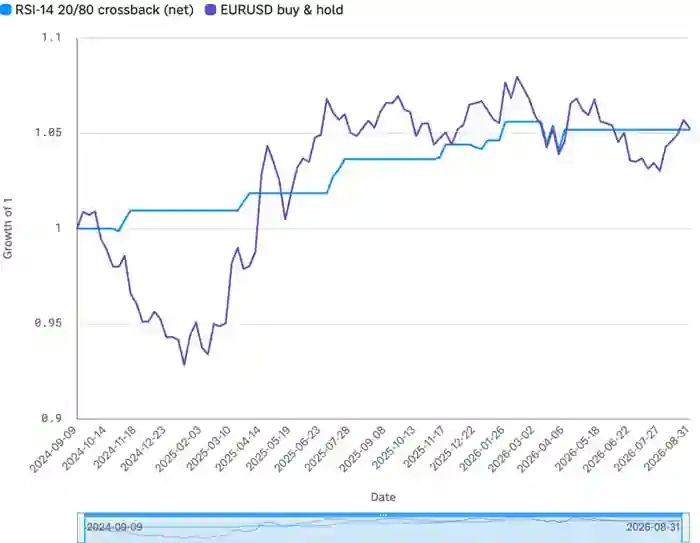

<!--
id: RX-USECASE-0037
type: use-case
language: ja
locale: ja
author: Reflexivity Research
published: 2026-09-15
status: published
translation_status: local-only
original_language: en
source_text_status: faithful_japanese_rendering_from_platform_research
publication_mode: faithful-source-preserving
-->

# EUR/USDのRSI戦略をパラメータ別・アウトオブサンプルで検証する

**著者:** Reflexivity Research  
**主な運用資産:** FX（EUR/USD）  
**想定利用者:** FX PM、クオンツ、システマティック運用  
**分析タイプ:** バックテスト、Walk-forward分析、Robustness検証

> 本ページは、Reflexivity上で実際に生成されたResearch出力を日本語で読みやすくしたものです。結論だけに要約せず、問い、データ、途中の判断、反証、前提・留意点、最終的な読みまで元のストーリーをできる限り保持しています。数値・市場環境は原Research実行時点のものです。

## 実際に行ったバックテスト

EUR/USD Spotで、Pure RSI Mean-Reversion Strategyを2年間検証。以下を総当たりしています。

- Lookback: **7 / 14 / 21**
- Threshold: **30/70、25/75、20/80**
- Rule: **Touch / Crossback**
- 合計 **18 combinations**
- 取引コスト: **1 pip round-trip**
- 1年目をCalibration、2年目をOut-of-sampleとするWalk-forward

## 重要なデータ上の留意点

依頼には4時間足も含まれていましたが、取得できたEUR/USD SeriesはDaily Barのみでした。Researchは**4時間足を合成・捏造せず、Dailyだけで実行した**ことを明示しています。

## 主な結果

1. **Medium Lookbackが最も安定**。Short LookbackはTurnoverが高くNoiseが多く、Long LookbackはTrade数が少ない。  
2. **Walk-forwardでOverfittingが露出**。Calibration BestのSharpe **2.47**がOOSで**0.57**まで低下。Degradation **1.90**。  
3. EUR/USDのSpreadが狭いため、このSampleではCost Impactは平均でCAGR約**0.11pp**にとどまり、問題はCostよりEdgeの弱さ。  
4. Full WindowのBest ComboでもNet CAGRは数%台で、絶対的なEdgeは大きくない。

全期間で最も良く見える組み合わせも、買い持ちとの比較やアウト・オブ・サンプルでの崩れ方まで一緒に見る必要があります。

*RSI-14・20/80・crossback戦略のネット成長率とEUR/USDの買い持ちを比較した元の調査の図表。*

## ウォークフォワード分析の代表例

| Combo | Cal Sharpe Y1 | Cal Net CAGR | OOS Sharpe Y2 | OOS Net CAGR | Sharpe Degradation |
|---|---:|---:|---:|---:|---:|
| RSI-14 20/80 crossback | 2.47 | 3.5% | 0.57 | 1.4% | 1.90 |
| RSI-14 30/70 crossback | 1.66 | 6.3% | 0.61 | 1.8% | 1.05 |
| RSI-14 25/75 crossback | 1.47 | 4.5% | 0.67 | 2.2% | 0.80 |
| RSI-14 25/75 touch | 1.38 | 2.5% | 0.71 | 1.3% | 0.67 |
| RSI-21 20/80 touch | 1.37 | 0.6% | 0.33 | 0.4% | 1.04 |
| RSI-21 25/75 touch | 1.20 | 1.0% | -0.64 | -0.9% | 1.84 |

Full 18-gridは原資料画像にそのまま残しています。

## 検証方法

- Window: **520 daily bars**, 2024-09-09〜2026-09-04
- Walk-forward split: **2025-09-07**
- RSI: Wilder smoothing
- Touch Rule: Oversold以下でLong、Overbought以上でShort
- Crossback Rule: Thresholdを再び跨いだところでEntryしMidlineでExit
- SignalはNext BarでTradeし、Look-aheadを避ける

## 分析上の留意点

- Daily-only。4h legは未実行
- 2年はParameter Sweepとして短い
- Sparse Signal ComboのHit Rate / Avg Win-Lossは観測数が少ない
- Slippage、Financing、Position Sizingは含まない
- Costが広いExecution環境ではShort-lookback / High-turnover Strategyから悪化しやすい

このResearchのストーリーは「良いBacktestを探す」ことではなく、**OOSで崩れるかを見て、戦略の弱さを発見する**ことです。

## このユースケースで確認できること

このResearchは、最終結論だけでなく、**どの問いから始め、どのデータを組み合わせ、途中で何を支持・反証材料とし、どの前提・留意点を明示したか**まで含めて再利用できる調査プロセスとして掲載しています。

---

[← 運用資産別ユースケース](../README.md) · [ユースケース一覧](../../README.md)
