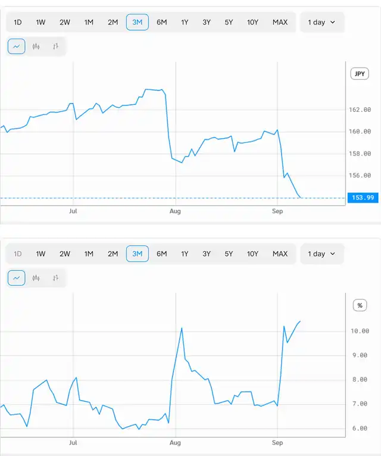

<!--
id: RX-USECASE-0044
type: use-case
language: ja
locale: ja
author: 株式会社QUICK
provider: 株式会社QUICK
provided: 2026-09-09
status: published
translation_status: local-only
source_type: partner-provided-use-case
asset_class: FX、債券、マクロ
roles: ウェルスマネジメント / RIA、ロングオンリー・アセットマネージャー、ヘッジファンド Tier 1
publication_mode: faithful-source-preserving
-->

# 急速な円高の背景と他通貨への広がりを分析する

**著者:** 株式会社QUICK  
**提供日:** 2026-09-09  
**主な運用資産:** FX、債券、マクロ  
**想定利用者:** ウェルスマネジメント / RIA、ロングオンリー・アセットマネージャー、ヘッジファンド Tier 1

> 本ページは株式会社QUICKから提供されたユースケースを、顧客名・宛先・メールアドレス・署名・非公開URL等を除き、質問から分析・結論へ進む元のストーリーを可能な限り保持して掲載しています。数値・市場環境は提供日時点のものです。

今日はAlfredで円高の背景について分析してみました。

**USD/JPYが急激な円高になってきていますが、この背景と他の通貨の動きについて分析してください。また、今後の見通しについて市場はどのように考えているかも分析してください。**

USD/JPYに軸足を置いて、値動き・背景・他通貨・今後の見通しを整理します。データは足元まで反映しています。

## 足元の動き：ドル円は164円台から154円割れ寸前へ

ドル円は6〜7月に上昇基調で、**7月23〜24日に163.85円前後まで円安**が進みました。しかしそこから流れが反転しています。

- 7月30日：163.4 → **159.5円へ急落**（1日で約4円の円高）
- 8月：159円前後でもみ合い（154〜160円のレンジ）
- 9月2日：158.7 → **9月3日 155.8円へ急落**（1日で約3円）
- 9月7日 154.4 → **9月8日 153.99円**（直近値）

ピーク（約164円）からわずか6週間で**約10円の円高**、直近の急落局面（9/2→9/8）だけでも約4%の円高です。この急変を映して、**1カ月物インプライド・ボラティリティ（ATM）は7%前後から10.4%へ急騰**しており、市場が急変動・当局介入リスクを織り込み始めていることを示します。

## 背景：日銀の利上げ観測、為替介入への警戒、米指標の弱さ

9月3日の急落は、報道によれば主に次の要因に帰せられています。

1. **日銀の追加利上げ観測**：9月17〜18日の日銀会合での利上げ期待が急速に高まった。8月の東京都区部CPI・7月全国CPIの加速、8月のサービス業PMI改善など、正常化継続を後押しする指標が続いた。
2. **為替介入への警戒**：急変動局面で「近く介入があり得る」との思惑が円買いを加速。
3. **米側の弱さがドルの重石に**：7月の雇用は減少（NFP -23,000）、8月NFPも市場予想は+55,000と低調。9月15〜16日のFOMCを前に米利下げ観測がくすぶり、日米金利差の縮小が円買いを支援。

土台にあるのは**日米金融政策の方向性の違い**です。日銀は正常化を進める一方、FRBは利下げ局面に傾きつつあり、金利差縮小が円高の構造要因になっています。積み上がっていた円キャリー（円売り）ポジションの巻き戻しが、この動きを短期間で増幅した構図です。

## 他通貨の動き：円が突出、ユーロ・ポンドは対ドルで底堅く

| 通貨ペア | 8月中旬 | 直近（9月上旬） | 傾向 |
| --- | --- | --- | --- |
| USD/JPY | 〜159円 | 〜154円 | 円が突出して急伸（円高） |
| EUR/USD | 〜1.157 | 〜1.161 | ユーロ底堅い |
| GBP/USD | 〜1.352 | 〜1.353 | ポンドほぼ横ばい |
| USD/CAD | 〜1.387 | 〜1.381 | カナダドルやや堅調 |

- **ユーロ**：9月10日のECB会合で**+25bpの利上げが見込まれ**、金利面から支えられ1.16ドル前後で堅調。
- **ポンド**：英CPIの加速はあるが、方向感は乏しくほぼ横ばい。
- **カナダドル**：カナダ中銀は9月2日に金利据え置き。関税不透明感を警戒しつつ小幅に底堅い。
- **円**：主要通貨の中でも際立って強含み。日銀利上げ観測・介入思惑・金利差縮小が重なった。

## 今後の市場の見立て

1. **最大の焦点は9月17〜18日の日銀会合**：利上げが実施・示唆されれば一段の円高、見送りなら反動で円安に振れやすい。
2. **9月15〜16日のFOMCも並行して重要**：米利下げが現実味を帯びれば金利差縮小で円高が加速、米金利が高止まりすれば円高は限定的、という綱引き。
3. **介入・当局リスク**：ボラティリティ急騰は、急変動局面での口先・実弾介入警戒を示唆。
4. **ポジションの偏り**：積み上がった円ショートの巻き戻しが円高を増幅してきた経緯があり、投機筋の持ち高次第でオーバーシュートしやすい一方、水準訂正後は反動も出やすい。

**総括**：今回のドル円の円高（約164円→154円割れ寸前）は、「日銀の利上げ観測+米利下げ観測による日米金利差縮小」というファンダメンタルズに、「介入警戒」と「円ショートの巻き戻し」という需給要因が重なって加速したものです。他通貨では円が突出して強く、市場の主眼はFOMCと日銀会合という2大イベントに移っています。

## 情報源

### エンティティ（3）

- JPN
- JPY
- USDJPY

### 時系列データ（5）

- JPY.price_twi
- JPN.central_bank_policy_rate
- JPN.cftc_jpy_speculative_net_positions_actual
- USDJPY.price
- USDJPY.implied_vol_1m

## このユースケースの位置づけ

ここに掲載した数値や市場判断は提供日時点のスナップショットです。ユースケースとしては、同じ質問の型を最新データや別の通貨・市場に置き換え、調査を再実行することを想定しています。

[← ユースケース一覧](../../README.md)
