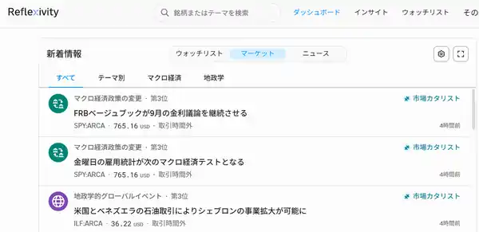

<!--
id: RX-USECASE-0049
type: use-case
language: ja
locale: ja
author: 株式会社QUICK
provider: 株式会社QUICK
provided: 2026-09-03
status: published
translation_status: local-only
source_type: partner-provided-use-case
asset_class: マクロ、株式、債券
roles: ウェルスマネジメント / RIA、ロングオンリー・アセットマネージャー、ヘッジファンド Tier 1
publication_mode: faithful-source-preserving
-->

# ベージュブックをマーケットカタリストから確認する

**著者:** 株式会社QUICK  
**提供日:** 2026-09-03  
**主な運用資産:** マクロ、株式、債券  
**想定利用者:** ウェルスマネジメント / RIA、ロングオンリー・アセットマネージャー、ヘッジファンド Tier 1
> 本ページは株式会社QUICKから提供されたユースケースを、顧客名・宛先・メールアドレス・署名・非公開URL等を除き、元資料の説明順を可能な限り保持して掲載しています。

今回は、マーケットカタリストで主なニュースの分析がご覧いただけます。
今日だと昨日のFRBベージュブックについての分析がご覧いただけます。

## この機能を使う場面

ベージュブックのような情報量の多い材料では、最初から全文を読むよりも、まず「市場にとって何が重要なのか」を短時間で把握し、必要な論点だけを深掘りしたい場面があります。

マーケットカタリストでは、担当する国・地域やテーマに合わせて重要イベントを絞り込み、見出しから分析へ進めます。この例では、ベージュブックが市場イベントとしてどう整理されているかを確認し、その後に詳細な分析を読む、という流れです。

## 確認の手順

ご覧いただく国・地域の設定がないと画面がブランクになります。ブランクの場合には、以下の手順で設定してください。

1. メニューの「インサイト」をクリックし、「マーケットカタリスト」を選択します。
2. 自分の担当領域に合わせてテーマや地域を設定します。どちらか一方だけでも構いません。
3. 表示された見出しからベージュブックなどの重要イベントを選びます。
4. 見出しをクリックし、主要ポイントと市場への含意を確認します。

ここでテーマや地域を先に設定するのは、すべてのニュースを均等に読むためではなく、自分の運用対象に関係する材料から優先順位を付けるためです。見出しで重要度を確認したうえで詳細へ進むことで、ニュース確認から追加調査までを一つの流れにできます。

## 運用上の読み方

この使い方のポイントは、ベージュブックそのものを要約することだけではありません。まず市場カタリストとして重要な論点を見つけ、そこから自分の担当する地域・テーマに関係する項目へ進むことで、「何を次に調べるべきか」を絞り込むための入口として使えます。

## このユースケースの位置づけ

ニュースを単に一覧で読むのではなく、マーケットカタリストから重要イベントの分析へ入り、対象国・地域・テーマを自分の担当領域に合わせて切り替えるワークフローの例です。

[← ユースケース一覧](../../README.md)
