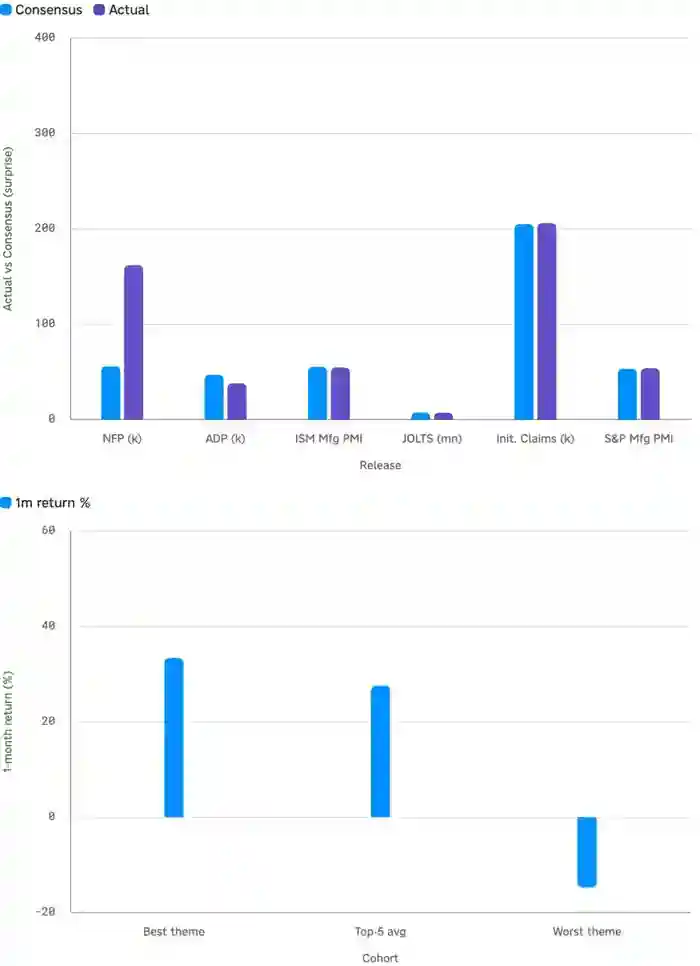

<!--
id: RX-USECASE-0036
type: use-case
language: ja
locale: ja
author: Reflexivity Research
published: 2026-09-15
status: published
translation_status: local-only
original_language: en
source_text_status: faithful_japanese_rendering_from_platform_research
publication_mode: faithful-source-preserving
-->

# 市場ナラティブとハードデータの乖離を複数市場から検証する

**著者:** Reflexivity Research  
**主な運用資産:** マクロ、株式、債券、クロスアセット  
**想定利用者:** CIO、マクロPM、マルチアセットPM、ストラテジスト  
**分析タイプ:** ナラティブ分析、クロスアセット分析、市場モニタリング
> 本ページは、Reflexivity上で実際に生成された調査結果を日本語で読みやすくしたものです。結論だけに要約せず、問い、データ、途中の判断、反証、前提・留意点、最終的な読みまで元のストーリーをできる限り保持しています。数値・市場環境は元の調査を実行した時点のものです。

## 調査の問い

**「Strong US Economy」というNarrativeは、本当に幅広い証拠に支えられてBroadeningしているのか、それとも一部の強いHeadlineに依存しているのか。**
原資料は直近60日程度のMacro News、Fed関連情報、Prediction Market、Equity Theme Leadership、Hard Dataを一つのScorecardにまとめています。

## 結論

原資料の結論は**Narrow, not broadening**です。Hard DataはMixed、Prediction MarketはCleanなGrowthよりInflation/Hike Riskを意識し、Equity Leadershipは集中していると評価しています。

## 3つの大きな乖離

### 1. 雇用: ヘッドラインと広がり

- August Payroll: **162k vs 56k expected**
- Private ADP Hiring: **38k**
Headlineは強いが、より広い雇用指標との整合性が弱いという指摘です。

### 2. 金融政策見通し: 市場織り込みとディスインフレ期待

- Hold: **50.5%**
- 25bp Hike: **49.5%**
- Cut: **約0.5%**
- Core PCE: **3.3%**
Soft/Strong EconomyのNarrativeならEasing期待が強まるはずなのに、市場はむしろ追加Tighteningの可能性を織り込んでいる点をContradictionとしています。

### 3. 株式のけん引役: 指数高値と内部の狭さ

- 1か月Theme PerformanceのLeader-to-Laggard Gap: **48pt**（+33.4%〜-14.7%）
- 調査したThemeのうち**10テーマがNegative**
- S&P 500: **7,718.6**、52週高値7,799の約99%
Indexは高値圏でも内部Breadthが広がっていないという読みです。
ニュースの語り口と、実際の経済指標・テーマ別リターンを横に並べると、どこまで同じ方向を向いているかが見えやすくなります。

*経済指標の実績対コンセンサスと、テーマ別の1カ月リターンを比較した元の調査の図表。*

## 直近60日の評価

| 証拠の種類 | 市場ナラティブ | ハードデータ | 判定 |
|---|---|---|---|
| Labor | Hot Payroll | ADP / broader gauge softer | Narrow |
| Fed / Prediction Markets | Benign, cuts coming | Hold/Hikeほぼ五分、Core PCE 3.3% | Contradicted |
| Equity Leadership | Broad rally | 48pt dispersion、10 themes negative | Narrow |
| News Tone | Strong Economy | Hike/Inflation-risk framingが約3.5倍 | Cautious |
| Manufacturing / Growth | Expansion intact | ISM New Orders 56.0→53.7、Retail Sales低下 | Decelerating |
| EOY State | Soft Landing | Soft Landing 55%、Overheating 42.5% | Split |

## 補足シグナル

- 30件のMacro Headline Sampleでは、Strong-dataより**Hike / Inflation-risk framingが約3.5倍**
- ISM New Ordersは**56.0 → 53.7**
- Polymarket: Soft Landing **55%**、Overheating **42.5%**
- Initial Jobless Claims **206k**、Unemployment **4.1%**はStabilizerとして残る

## 分析上の留意点

- 対象期間のFed一次資料がDocument Indexから完全には取得できず、一部はCalendar / Newsから推定
- Equity Theme名が匿名化され、Named SectorではなくReturn DispersionでBreadthを測定
- News ToneはKeyword-based Headline Tallyで、校正済みSentiment Scoreではない
- Economic Calendar SurpriseはTool Range制約により直近週中心
「Narrative」をNewsだけで判断せず、**Macro Data・Rates・Equity Internals・Prediction Marketを同じ問いの下で横断する**調査です。

## このユースケースで確認できること

この調査は、最終結論だけでなく、**どの問いから始め、どのデータを組み合わせ、途中で何を支持・反証材料とし、どの前提・留意点を明示したか**まで含めて再利用できる調査プロセスとして掲載しています。

---

[← 運用資産別ユースケース](../README.md) · [ユースケース一覧](../../README.md)
