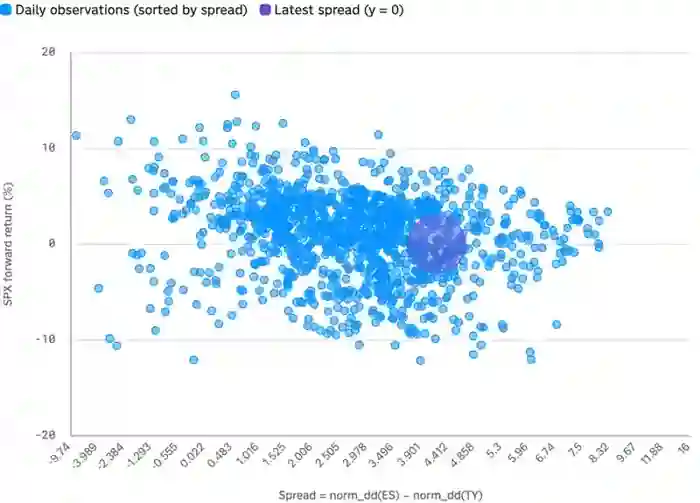

<!--
id: RX-USECASE-0033
type: use-case
language: ja
locale: ja
author: Reflexivity Research
published: 2026-09-15
status: published
translation_status: local-only
original_language: en
source_text_status: faithful_japanese_rendering_from_platform_research
publication_mode: faithful-source-preserving
-->

# 債券市場の動きが株式の先行リターンと関係するか検証する

**著者:** Reflexivity Research  
**主な運用資産:** 債券、株式、クロスアセット  
**想定利用者:** マルチアセットPM、クオンツ、アセットアロケーター  
**分析タイプ:** クロスアセット分析、時系列分析、仮説検証

> 本ページは、Reflexivity上で実際に生成された調査結果を日本語で読みやすくしたものです。結論だけに要約せず、問い、データ、途中の判断、反証、前提・留意点、最終的な読みまで、元のストーリーをできる限り保持しています。数値・市場環境は元の調査を実行した時点のものです。

## 実際に検証したこと

「債券側のスプレッドが大きく動いたとき、その後のS&P 500リターンに傾向があるか」を、**現在値を過去分布の中に置く**形で検証した調査です。

## 散布図の作り方

- 標本数: **1,244の日次観測値**
- 期間: **2021年9月〜2026年8月**
- X軸: 対象スプレッドを小さい順から大きい順へ並べる
- Y軸: **20営業日先のS&P 500リターン**
- 最新スプレッドを別の系列として強調表示

この設定で1,244個の観測値を散布図にすると、最新値が過去分布のどこに位置するかと、同じ水準で将来リターンがどれほどばらついたかを同時に見られます。

*債券市場のシグナルと、その後の株式リターンを観測値ごとに比較した散布図。*

## 元の調査の読み

- 最新スプレッド: **+7.72**（2026-09-01時点）
- 5年間のスプレッドと20営業日先S&P 500リターンの相関: **-0.22**
- 高いスプレッドは平均より低い先行リターン側にやや傾くものの、同じX水準でYの分散が非常に広く、**シグナルは弱い**と評価

重要なのは、調査が「債券シグナルが株を予測できる」と強い結論を作らなかったことです。むしろ、**仮説を定量化した結果、相関が弱いこと自体を結論として残している**点がこのユースケースの核です。

## 最新値マーカーの意味

最新値のマーカーはY=0に置かれていますが、これは**現在のスプレッドがX軸のどこにあるかを示す視覚上の基準**です。まだ観測できない未来20営業日のリターンを予測した値ではありません。

## 分析上の留意点

- 20営業日先を見る窓が重複している
- -0.22は全標本を一本の直線関係で要約した値にすぎない
- 対象期間が特定の市場局面に偏る可能性がある
- スプレッドの定義や期間を変えると結果が変わり得る

このように、複数資産にまたがる経験則を「それらしい説明」で終わらせず、実際の時系列に載せて**効いていない可能性まで確認する**のがこの調査のストーリーです。

## このユースケースで確認できること

この調査は、最終結論だけでなく、**どの問いから始め、どのデータを組み合わせ、途中で何を支持・反証材料とし、どの前提・留意点を明示したか**まで含めて再利用できる調査プロセスとして掲載しています。

---

[← 運用資産別ユースケース](../README.md) · [ユースケース一覧](../../README.md)
