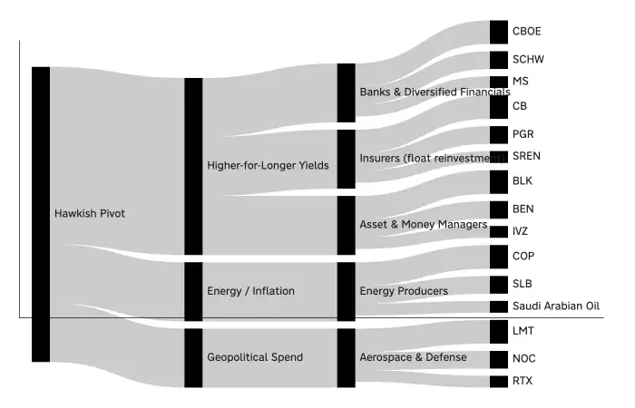

<!--
id: RX-USECASE-0034
type: use-case
language: ja
locale: ja
author: Reflexivity Research
published: 2026-09-15
status: published
translation_status: local-only
revised: 2026-09-27
editorial_reviewed: 2026-09-27
original_language: en
source_text_status: faithful_japanese_rendering_from_platform_research
publication_mode: faithful-source-preserving
-->

# 金融政策のタカ派転換から恩恵を受ける資産・業種・企業をたどる

[← 運用資産別ユースケース](../README.md) · [ユースケース一覧](../../README.md)

**著者:** Reflexivity Research  
**主な運用資産:** 株式、債券、FX、複数資産  
**想定利用者:** マクロPM、マルチアセットPM、株式PM  
**分析タイプ:** ナレッジグラフ、テーマ分析、投資ユニバース構築
> 本ページは、Reflexivity上で実際に生成された調査結果を日本語で読みやすくしたものです。結論だけに要約せず、問い、データ、途中の判断、反証、前提・留意点、最終的な読みまで元のストーリーをできる限り保持しています。数値・市場環境は元の調査を実行した時点のものです。

**[Reflexivityでこの調査例を開く →](https://app.reflexivity.com/app/alfred?conversationId=9e6182f9-1853-4fdd-8ec4-f5b2a42fcfab&mode=research&activeHistorySidebarCategory=all)**

## 調査の問い

タカ派的な金融政策転換を「金利が上がる」で終わらせず、**一次のマクロ経路 → 二次のセクター → 三次の個別企業**までナレッジグラフでたどる例です。

## 一次効果: マクロの伝達経路

原資料は、受益候補につながる主要な伝達経路を3つに整理しています。
1. **高金利の長期化**
2. **エネルギー・インフレ**
3. **地政学関連支出**

## 二次効果: セクター

- 高金利の長期化 → 銀行・総合金融、保険、資産運用・マネーマーケット関連
- エネルギー・インフレ → エネルギー生産企業
- 地政学関連支出 → 航空宇宙・防衛
特に金利経路は、銀行のNIM、保険会社の運用資産再投資利回り、マネーファンドや現金運用利回り等を通じて、幅広い受益候補につながるという読みです。
政策ショックからテーマ、セクター、企業へとつながる経路は、ナレッジグラフ上では次のように可視化されます。

*タカ派的な政策ショックが、テーマやセクターを経由して企業へ波及する経路。*

## 三次効果: 企業

原資料でナレッジグラフ上位の構成銘柄として挙げられた例:
- 金融: **CBOE、SCHW、Morgan Stanley**
- 保険: **Chubb、Progressive、Swiss Re**
- 資産運用: **BlackRock、Franklin Resources、Invesco**
- エネルギー: **ConocoPhillips、SLB、Saudi Arabian Oil**
- 防衛: **Lockheed Martin、Northrop Grumman、RTX**
原資料にはさらに、消費者向け融資、公益、不動産、住宅建設、自動車、信用・融資など、多数の候補が表示されています。

## サンキー図の読み方

リンクの太さは、実際のキャッシュフローや利益感応度を示すものではありません。
- 起点 → 伝達経路: その経路がどのセクターへ波及するか
- セクター → 企業: ナレッジグラフ上の関連度
を表す**説明用の代理指標**です。

## 分析上の留意点

- 一次・二次・三次という階層は分析上の整理であり、ナレッジグラフ自体が「一次効果」を保証するものではない
- グラフ上のリンクは企業の利益感応度を直接測定しない
- 高金利の長期化は金融機関の利ざやに追い風でも、同時に信用コストや需要悪化のリスクを伴う
- 企業ごとの実際の感応度は異なる
つまりこの調査は、マクロの見方から**「次に詳しく調べる企業群」**を作り、その後の企業ファンダメンタル調査へつなぐための探索です。

## このユースケースで確認できること

このページでは、政策テーマをマクロの伝達経路、セクター、個別企業へ段階的に分解し、**次に詳しく調べる企業群を作る**流れを確認できます。グラフ上の関連度を、そのまま利益感応度とみなさない点も重要です。

---

[← 運用資産別ユースケース](../README.md) · [ユースケース一覧](../../README.md)
