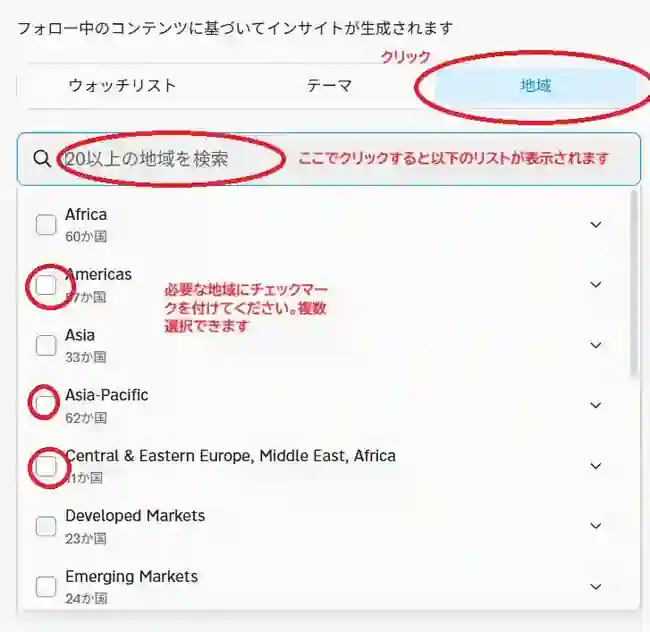
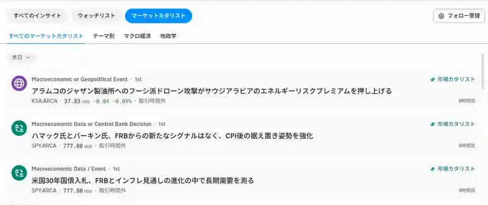

<!--
id: RX-USECASE-0055
type: use-case
language: ja
locale: ja
author: 株式会社QUICK
provider: 株式会社QUICK
provided: 2026-08-17
status: published
translation_status: local-only
source_type: partner-provided-use-case
asset_class: 株式、マクロ、マルチアセット
roles: ウェルスマネジメント / RIA、ロングオンリー・アセットマネージャー、ヘッジファンド Tier 1、ヘッジファンド Tier 2
publication_mode: faithful-source-preserving
-->

# ニュースからテーマ・国・企業への影響を追う

**著者:** 株式会社QUICK  
**提供日:** 2026-08-17  
**主な運用資産:** 株式、マクロ、マルチアセット  
**想定利用者:** ウェルスマネジメント / RIA、ロングオンリー・アセットマネージャー、ヘッジファンド Tier 1、ヘッジファンド Tier 2
> 本ページは株式会社QUICKから提供されたユースケースを、顧客名・宛先・メールアドレス・署名・非公開URL等を除き、元資料の説明順を可能な限り保持して掲載しています。数値・市場環境は提供日時点のものです。

Reflexivityの利用例についてご案内します。
今回は、マーケットカタリストのご紹介です。

## この機能を使う場面

ニュースの見出しを読むだけでは、「その材料が自分のポートフォリオにどう関係するのか」「次にどのテーマや企業を調べるべきか」までは分かりません。

マーケットカタリストでは、ニュースから市場への影響を整理し、関連するテーマ、国、企業へつなげて確認します。ニュースの要約をゴールにするのではなく、**イベント → 影響経路 → 次の調査対象**まで進むための入口として使います。

例えば、以下のようなニュースに対する分析を流しています。

- アラムコのジャザン製油所へのフーシ派ドローン攻撃がサウジアラビアのエネルギーリスクプレミアムを押し上げる
- 米国30年国債入札、FRBとインフレ見通しの変化の中で長期需要を測る
- OPEC、IEAが2026年の石油需要見通しを大幅に引き下げ、戦争リスクにもかかわらず原油が急落
- 米国の失業保険申請件数はコンセンサス近辺で、ソフトランディングの見方とFRBの漸進的な緩和を支持

## 設定と確認の流れ

まず、自分が担当する地域やテーマを設定します。すべてのニュースを同じ重みで追うのではなく、担当領域に関係するカタリストから優先して確認するためです。

1. メニューの「インサイト」をクリックし、「マーケットカタリスト」を選択します。
2. テーマや地域を設定します。どちらか一方だけでも構いません。

設定すると、該当する市場カタリストが一覧に表示されます。ここで見出しを比較し、重要度や自分の運用対象との関連性から、詳しく読むイベントを選びます。

見出しを開いた後は、ニュースそのものだけでなく、どのテーマ・国・企業へ影響が及ぶのかを確認します。そこで見つかった関連先を、次の企業分析やテーマ分析の候補にできます。

## 運用上の読み方

このワークフローの目的はニュースを速く消化することだけではありません。まず自分の担当領域に関係するイベントを絞り、そのイベントがどこへ波及するかをたどることで、追加調査の優先順位を決めやすくします。

## このユースケースの位置づけ

ニュースを単に要約するのではなく、ニュースから影響テーマ、国、企業へ関係をたどり、次の調査対象を見つけるワークフローの例です。

[← ユースケース一覧](../../README.md)
