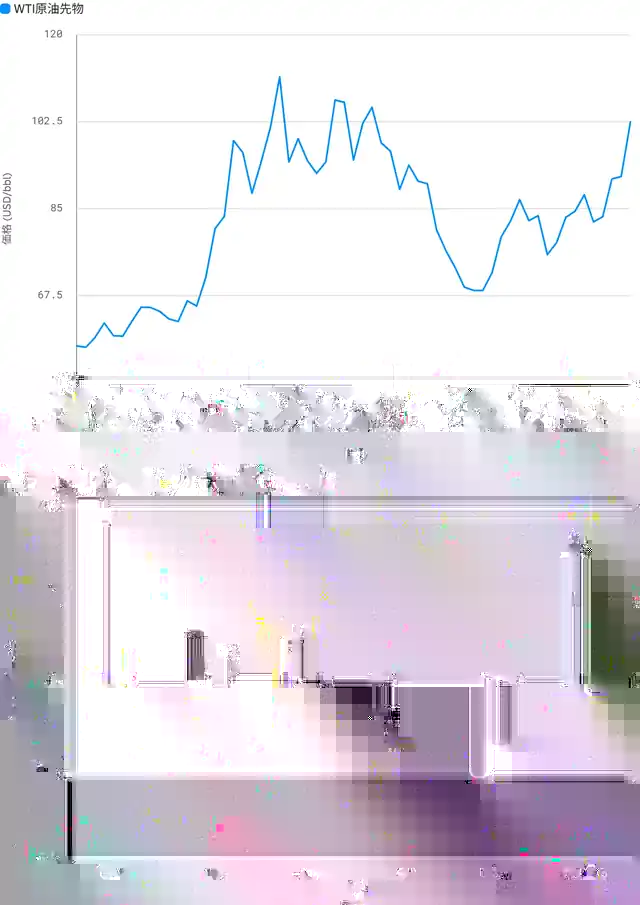

<!--
id: RX-USECASE-0045
type: use-case
language: ja
locale: ja
author: 株式会社QUICK
provider: 株式会社QUICK
provided: 2026-09-14
status: published
translation_status: local-only
source_type: partner-provided-use-case
asset_class: コモディティ、株式、マクロ、マルチアセット
roles: ロングオンリー・アセットマネージャー、ヘッジファンド Tier 1、ヘッジファンド Tier 2
publication_mode: faithful-source-preserving
-->

# 原油高の原因を局面別に比較し、影響業種までたどる

**著者:** 株式会社QUICK  
**提供日:** 2026-09-14  
**主な運用資産:** コモディティ、株式、マクロ、マルチアセット  
**想定利用者:** ロングオンリー・アセットマネージャー、ヘッジファンド Tier 1、ヘッジファンド Tier 2
> 本ページは株式会社QUICKから提供されたユースケースを、顧客名・宛先・メールアドレス・署名・非公開URL等を除き、質問から分析・結論へ進む元のストーリーを可能な限り保持して掲載しています。数値・市場環境は提供日時点のものです。

原油価格が再度急上昇していますので、3月の時の状況との違いをAlfredで聞きました。

**今年3月に米国とイランの戦争が始まった際の原油価格の上昇と、8月以降の原油価格の上昇の背景の違いを教えてください。また原油価格の上昇によって影響を受けた業種と主な企業についても分析して下さい。**

## この調査で確かめたいこと

原油価格が同じように上昇していても、原因が**物理的な供給途絶、需要見通し、増産、地政学的リスクプレミアム**のどれかによって、持続性と企業への波及は変わります。したがって、価格上昇幅だけを比較しても、どの業種が恩恵・逆風を受けるかまでは判断できません。

そこで、まず3月と8月以降を別の局面として切り分け、各局面で何が原油価格を押し上げたかを比較します。その後、同じ原油高でも企業リターンがどう違ったかをエネルギー、航空、化学で確認します。

この順番にすることで、**原油価格の動き → 上昇の原因 → コスト／売価への伝播 → 業種・企業の反応**までつなげて読みます。

## 概要

2026年の原油（WTI）は2つの明確な上昇局面を経験しました。3月の急騰は**地政学的な供給ショック**、8月以降の上昇は**需給主導（供給リスク＋見通し変化）**が主因で、性質が異なります。

## 1. 三月と八月以降の上昇背景の違い

最初に上昇要因を分けるのは、「原油高」という同じ結果でも、価格が高止まりする条件が異なるためです。

### 三月局面（米・イラン戦争）— 地政学的供給ショック

- 米・イランの戦争勃発でペルシャ湾／ホルムズ海峡の輸出が遮断され、供給途絶懸念が価格を押し上げ（WTIは約+80%上昇）。
- WTIは2月中旬の$62.89から4月上旬の年間高値$112.95（4年ぶり高値）まで急騰。
- フーシ派のイスラエル攻撃など中東情勢の悪化も上乗せ要因。IMFはホルムズ閉鎖でリセッションリスクを警告する事態に。
- 性質：**突発的・単発的なショック**。供給が物理的に断たれる懸念による急騰。

### 八月以降の局面 — 需給主導＋新供給リスク

- 8月初にOPEC+が追加増産で合意し一旦急落した後、再上昇（この局面で約+25%上昇）。
- OPEC・IEAは需要見通しを下方修正する一方、サウジのパイプライン攻撃による世界供給への喪失リスク、Iran-linked gas shockなど新たな供給不安が浮上。
- WTIは8月初の$80.34から9月中旬の$100.05へ（ブレントも$100超え）。
- 性質：**需給バランスと供給リスクの綱引き**。増産・需要鈍化の下押しと地政学的供給不安の押し上げが混在する複雑な構造。

## 2. 影響を受けた業種と主要企業

上昇の原因を切り分けたら、次にその違いが企業へどう伝わったかを確認します。原油生産企業には売価上昇が直接追い風になりやすい一方、航空では燃料コスト、化学では原料コストと製品価格転嫁のバランスが重要になるためです。

| 企業 | 業種 | 3月局面 | 8月以降 | 年初来 |
| --- | --- | ---: | ---: | ---: |
| Occidental (OXY) | エネルギー(生産) | +37.0% | +10.8% | +45.0% |
| ExxonMobil (XOM) | エネルギー(統合) | +12.1% | +7.0% | +35.3% |
| Chevron (CVX) | エネルギー(統合) | +11.6% | +10.8% | +37.3% |
| Dow (DOW) | 化学 | +31.8% | -2.9% | +19.6% |
| Delta (DAL) | 航空 | -7.4% | -12.8% | +15.7% |
| United Airlines (UAL) | 航空 | -21.7% | -14.5% | -2.8% |

### 恩恵を受けた業種（プラス）

- **エネルギー（石油・ガス生産／統合）**：原油高が直接収益に寄与。Occidental (OXY) が3月局面で+37.0%と最も反応、ExxonMobil (XOM) +12.1%、Chevron (CVX) +11.6%。OXYは年初来で+45.0%と市場を大幅アウトパフォーム。

### 打撃を受けた業種（マイナス）

- **航空**：ジェット燃料コスト増が最大の逆風。United Airlines (UAL) は3月局面-21.7%・8月以降-14.5%、Delta (DAL) も3月-7.4%・8月以降-12.8%と両局面で下落。

### 方向が局面で変わった業種

- **化学**：Dow (DOW) は3月局面で製品価格転嫁期待から+31.8%と急騰したが、8月以降は需要見通し悪化で-2.9%と反落。原料コスト上昇はマージン圧迫要因でもあり、需給環境次第で明暗が分かれた。

## 運用上の読み方

この比較で重要なのは、「原油高ならエネルギー買い、航空売り」と固定的に読むことではありません。まず今回の価格上昇が供給途絶型か、需給・見通し型かを確認し、その違いが各業種の売価・コスト・需要へどう伝わるかを見ます。

次に調査を更新する場合は、供給途絶の実態、OPEC+の増産、需要見通し、精製マージンや航空燃料コストなど、現在の局面を維持・反転させる変数を確認すると、企業への波及も更新しやすくなります。

## 留意点

- 局面リターンは代表日で算出した参考値です。個別株は原油以外の要因（決算・金利・個別材料）も含みます。
- 背景の定性分析は当該期間のニュース見出しとマーケット・カタリストに基づいています。

## 情報源

### エンティティ（7）

- CL:NYMEX
- DAL:NYSE
- DOW:NYSE
- OXY:NYSE
- UAL:NASD
- XOM:NYSE
- CVX:NYSE

### 時系列データ（7）

- DOW:NYSE.price
- CL:NYMEX.price
- CVX:NYSE.price
- OXY:NYSE.price
- DAL:NYSE.price
- UAL:NASD.price
- XOM:NYSE.price

## このユースケースの位置づけ

ここに掲載した数値や市場判断は提供日時点のスナップショットです。同じ価格上昇でも原因を局面別に分け、その違いを業種・企業の感応度へつなげるクロスアセット分析の例です。

[← ユースケース一覧](../../README.md)
