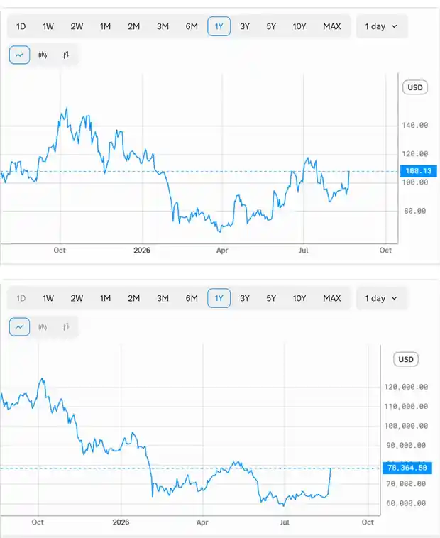

<!--
id: RX-USECASE-0050
type: use-case
language: ja
locale: ja
author: 株式会社QUICK
provider: 株式会社QUICK
provided: 2026-08-24
status: published
translation_status: local-only
source_type: partner-provided-use-case
asset_class: 株式、暗号資産、マルチアセット
roles: ヘッジファンド Tier 1、ヘッジファンド Tier 2、マルチアセット運用
publication_mode: faithful-source-preserving
-->

# Robinhood株とビットコインの価格連動性を検証する

**著者:** 株式会社QUICK  
**提供日:** 2026-08-24  
**主な運用資産:** 株式、暗号資産、マルチアセット  
**想定利用者:** ヘッジファンド Tier 1、ヘッジファンド Tier 2、マルチアセット運用
> 本ページは株式会社QUICKから提供されたユースケースを、顧客名・宛先・メールアドレス・署名・非公開URL等を除き、質問から分析・結論へ進む元のストーリーを可能な限り保持して掲載しています。数値・市場環境は提供日時点のものです。

Reflexivityの利用例についてご案内します。
今回はAlfredにてRobinhood株とビットコインの関係性について聞いてみました。

**@HOODとビットコインの価格との相関を分析してください。**

＠のあとにTickerを入れて問い合わせることもできます。「ロビンフッド」と入れていただいてもいいですが、似たような名前の銘柄がある場合にはTicker指定の方がより正確な結果となります。

## この調査で確かめたいこと

2つの価格チャートが同じ方向に上がっているだけでは、本当に日々連動しているのか、単に両方が長期上昇トレンドを持っているだけなのかを判断できません。また、相関が高くても、個別企業の材料によって関係が崩れる局面があります。

そこで、まず過去1年間のピーク・ボトムや急変日を並べて**同じタイミングで動いているか**を確認します。次に価格水準だけでなく日次リターンの相関も見て、共通トレンドと短期的な連動を分けます。そのうえで、両者が乖離した時期を探し、Robinhood固有の材料がビットコイン要因を上回る条件を考えます。

この順番にすることで、**見た目の連動 → 定量的な相関 → 例外・乖離局面 → 関係を生む経済的な理由**へ進めます。

HOOD（ロビンフッド）とビットコインの過去1年間の価格データを分析しました。結論から言うと、**両者は強い正の相関関係にあります**。同じマクロ・リスク選好の波に乗って、ほぼ同じタイミングで上昇・下落しています。

## 分析結果（2025年8月〜2026年8月、日次終値）

| 局面 | 時期 | HOOD | ビットコイン | 方向 |
| --- | --- | --- | --- | --- |
| 出発点 | 2025年8月末 | ~108 | ~110,000 | - |
| ピーク | 2025年10月上旬 | ~150 | ~124,800 | 同時に高値 |
| 急落（クラッシュ） | 2026年2月上旬 | 72 | ~63,300 | 同時に暴落 |
| 二番底 | 2026年6月 | ~93 | ~58,500 | やや乖離 |
| 直近反発 | 2026年8月21日 | 108 | ~78,400 | 同時に急騰 |

主な観測点:
- **同時のピーク・ボトム**：両者とも2025年10月に高値を付け、2026年2月上旬に急落しました。2月5日にはHOODが約-10%、ビットコインが約-16%と同日に暴落しており、リスクオフに対して連動しています。
- **直近の急騰も連動**：2026年8月19〜21日にビットコインが約63,000→78,400ドルへ急伸するのに合わせ、HOODも約95→108ドルへ跳ね上がりました（8月21日は+13.7%）。
- **推定相関**：価格水準（レベル）の相関はおよそ**+0.8前後**と非常に高く、日次リターンベースでも中〜強程度（概ね+0.5〜0.6）の正の相関が見られます。

### なぜ価格水準と日次リターンを分けて見るのか

価格水準の高い相関は、両方の資産が長期的に同じ方向へトレンドしているだけでも高くなり得ます。日次リターンでも正の相関が残るかを見ることで、「長期トレンドが似ている」ことと「日々の値動きが連動している」ことを分けて確認できます。

## 乖離した局面（注意点）

相関を確認した後は、関係が崩れた局面を見ることが重要です。完全な連動ではありません。

**2026年6月**が典型的な乖離期で、ビットコインが約58,500ドルまで下げ続けた一方、HOODは逆に105〜108ドルへ回復しました。この時期はHOOD固有の材料（自社の業績・株式取引部門など）が暗号資産価格から一時的に切り離されて動いたことを示唆します。

## 解釈

ロビンフッドの収益は暗号資産取引手数料への依存度が高いため、ビットコイン価格は同社の業績期待を左右する重要ドライバーです。加えて両者とも「高ベータのリスク資産」として同じマクロ環境（金利・リスク選好）に反応するため、方向感が揃いやすい構造です。ただし個別材料が出ると短期的に乖離しうる点は留意してください。

※相関係数は提供データからの概算値です。

## 運用上の読み方

相関が高いという結果を、そのまま「HOODはビットコインの代理」と読むのではなく、相関が維持されている局面と崩れている局面を分けて使います。次に調査を更新する場合は、暗号資産取引量、Robinhoodの決算・ガイダンス、金利やリスク選好を合わせて見れば、連動の理由が変わったかを確認できます。

## 情報源

- エンティティ: HOOD:NASD, BTCUSD
- 時系列データ: HOOD:NASD.price, BTCUSD.price

## このユースケースの位置づけ

ここに掲載した数値や市場判断は提供日時点のスナップショットです。見た目の価格連動を、リターン相関と乖離局面まで掘り下げて検証するクロスアセット分析の例です。

[← ユースケース一覧](../../README.md)
