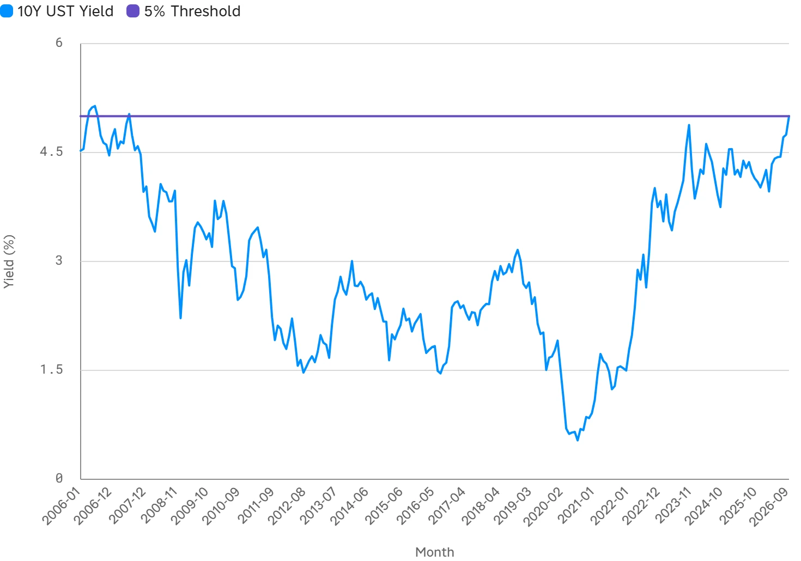

<!--
id: RX-USECASE-0063
type: use-case
language: ja
locale: ja
provider: 株式会社QUICK
provided: 2026-09-16
status: published
translation_status: local-only
revised: 2026-09-27
editorial_reviewed: 2026-09-27
source_type: partner-provided-use-case
asset_class: 債券、マクロ、株式
publication_mode: faithful-source-preserving
-->

# 米10年債利回り5%という節目を過去20年と比較する

[← 債券ユースケース](README.md) · [ユースケース一覧](../../README.md)

**提供日:** 2026-09-16  
**主な運用資産:** 債券、マクロ、株式

> 本ページは株式会社QUICKから提供されたユースケースを、顧客名・宛先・メールアドレス・署名等を除き、質問から分析・結論へ進む流れを可能な限り保持して掲載しています。数値・市場環境は提供日時点のものです。

> なお、提供資料には画像が1点含まれていますが、Reflexivityの調査結果へのリンクは含まれていません。本文と提供画像を掲載しています。

## 質問

**米国債の利回りが5%を超えるか否かで、経済や金融市場に与える影響はどのように変化するのでしょうか？ 過去20年間の事例なども参考にして、現在の市場の状況を分析してください。**

## 5%は何を意味するのか

提供日時点では、米10年債利回りが2026年9月15日に5.00%へ到達し、2007年以来の水準に乗せたと整理されています。過去1年で約94bp、年初来で約88bp上昇しており、原油価格の100ドル超え、利上げ観測の再燃、政策金利3.75%、CPI前年比3.4%といった背景が挙げられています。

この分析では、5%を単なる丸い数字としてではなく、**景気後退回避と再燃するインフレ・財政懸念のどちらを市場が強く織り込むかを見る節目**として扱っています。

主な確認点は3つです。

1. **現在は節目の境界線上**  
   5.004%は提供日時点の52週高値で、過去20年の高値5.29%（2007年6月）にも近い水準です。

2. **過去20年で5%超えは稀**  
   明確に5%を超えたのは2006年と2007年で、2023年10月は4.94%まで上昇したものの5%は超えていません。

3. **今回の背景はGFC前と異なる**  
   提供日時点の2年-10年スプレッドは約+33bpで順イールドでした。逆イールドを伴ったGFC前とは異なり、今回の金利上昇は景気後退懸念よりもインフレ・財政プレミアムの色彩が強い可能性がある、と分析しています。

## 過去の5%到達局面と現在

| 時期 | 10年債利回り | 背景 |
| --- | ---: | --- |
| 2026年9月 | 5.00% | 原油100ドル超、利上げ観測再燃、Fed 3.75%、CPI 3.4% |
| 2023年10月 | 4.94% | 利上げサイクル後半。5%手前で反転 |
| 2007年6月 | 5.29% | GFC前、逆イールド後に景気後退 |
| 2006年4〜7月 | 5.25% | Fed引き締め、住宅市場ピーク |

### 提供日時点の派生統計

| 指標 | 値 |
| --- | ---: |
| 10年債利回り | 5.004% |
| 1日変化 | +2.1bp |
| 月初来 | +25.8bp |
| 3か月 | +57.0bp |
| 6か月 | +77.8bp |
| 1年 | +94.2bp |
| 年初来 | +87.8bp |
| 52週高値 | 5.004% |
| 52週安値 | 3.955% |
| 2s10sスプレッド | +33.3bp |
| 30年債 / 2年債 | 5.34% / 4.671% |

## 5%未満と5%超で何が変わるか

**5%未満のレンジ**では、株式バリュエーションへの圧力や住宅ローン・社債コストの上昇が比較的緩やかで、債券より株式へ資金が向かいやすい環境が維持されやすいとしています。

一方で**5%を明確に超える局面**では、割引率上昇により高PERのグロース株・ハイテク株が影響を受けやすくなり、無リスク利回り5%が現金・短期債を株式の強い代替にします。住宅ローン金利、社債コスト、政府の利払い負担も重くなりやすく、心理的・機械的な閾値としてリスク資産からの資金移動を促す可能性があると整理されています。

## 過去の事例から読み取ること

- **2006〜2007年**：Fedの引き締め完了後、逆イールド下での5%超えは、その後の景気後退に先行しました。
- **2023年10月**：4.94%まで上昇したものの5%手前で反転し、その後の金利低下とともに株式市場は反発しました。
- **2026年9月**：順イールド下での5%到達という点で過去と異なり、インフレ、原油、財政、供給要因の影響がより強い可能性があります。

この比較で重要なのは、**同じ5%でも背景が違えば市場への意味も違う**という点です。

## 分析上の留意点

- 利回り、政策金利、CPIはそれぞれ最新日が異なります。
- 30年債はFRED、その他はReflexivity内の系列を使っており、更新タイミングに差があります。
- 「5%超えの影響」の一部は歴史的パターンと市場コメントを使った解釈で、確定的な予測ではありません。
- 原油価格やFed発言は定量系列ではなくニュース文脈として扱っています。

さらに、実質金利・ブレークイーブン・タームプレミアムへの分解や、S&P500のグロース対バリューの金利感応度分析へ深掘りできます。

---

本コンテンツは、株式会社QUICKよりご提供いただいたものです。

国・地域や言語環境、利用製品、データ提供範囲などによっては、内容をそのまま適用できない場合があります。

[← 債券ユースケース](README.md) · [ユースケース一覧](../../README.md)
