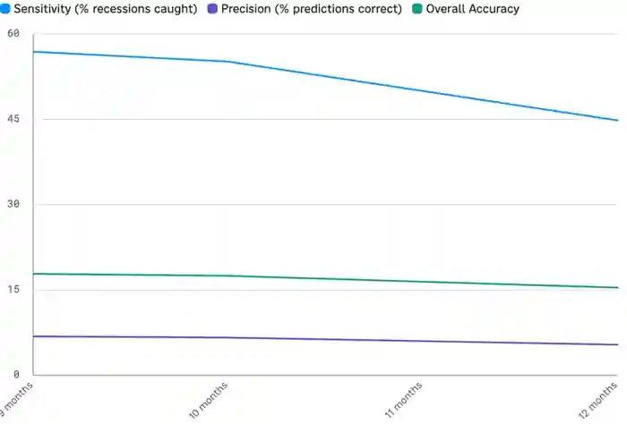

<!--
id: RX-USECASE-0031
type: use-case
language: ja
locale: ja
author: Reflexivity Research
published: 2026-09-15
status: published
translation_status: local-only
original_language: en
source_text_status: faithful_japanese_rendering_from_platform_research
publication_mode: faithful-source-preserving
-->

# 2年・10年金利差は本当に景気後退を予測できるか検証する

**著者:** Reflexivity Research  
**主な運用資産:** 債券（米国金利）、マクロ  
**想定利用者:** 債券PM、マクロストラテジスト、アセットアロケーター  
**分析タイプ:** 仮説検証、時系列分析

> 本ページは、Reflexivity上で実際に生成されたResearch出力を日本語で読みやすくしたものです。結論だけに要約せず、問い、データ、途中の判断、反証、前提・留意点、最終的な読みまで元のストーリーをできる限り保持しています。数値・市場環境は原Research実行時点のものです。

## 実際の問い

**米国2年・10年金利差の逆転は、9〜12か月先の景気後退を歴史的にうまく予測してきたのか。**

原資料は1976〜2025年を対象に、逆イールドと景気後退の関係をLead Time別に検証し、「有名な経験則を実際のデータで反証できるか」を試しています。

> **編集上の注意:** この原資料には、データ構築・定義の再確認が必要と考えられる数値が含まれます。以下はResearch出力を忠実に記録したもので、統計結果を検証済みの一般事実として掲載するものではありません。特に「1976年以降83.5%の期間で逆イールドだった」という記述は、定義・集計方法を再検証する必要があります。

## 原資料の先行期間別結果

| 指標 | 9か月 | 10か月 | 11か月 | 12か月 |
|---|---:|---:|---:|---:|
| Sensitivity | 56.9% | 55.2% | 50.0% | 44.8% |
| Precision | 6.8% | 6.6% | 6.0% | 5.4% |
| False Positive Rate | 86.5% | 86.7% | 87.3% | 87.9% |
| Overall Accuracy | 17.9% | 17.5% | 16.5% | 15.4% |

原資料は10か月LeadでPrecision 6.6%、False Positive Rate 86.7%という結果を示し、**「逆イールドが出た」こと自体をActionableな景気後退シグナルとして使うとFalse Alarmが多い**という結論に進みます。

次に、実際の景気後退局面とシグナルの出方を時系列で重ね、見逃しと偽陽性の両方を確認します。

*景気後退シグナルを履歴上で検証した元の調査の図表。*

## 景気後退ごとの検証

| 景気後退 | 期間 | 9〜12か月前に逆イールドで予測? | 原資料の平均Spread |
|---|---|---|---:|
| 1980-02〜1980-08 | 6か月 | No | 0.60% |
| 1981-08〜1982-12 | 16か月 | Yes | 0.53% |
| 1990-08〜1991-04 | 8か月 | Yes | 0.04% |
| 2001-04〜2001-12 | 8か月 | No | 0.36% |
| 2008-01〜2009-07 | 18か月 | Yes | 0.03% |
| 2020-03〜2020-05 | 2か月 | Yes | -0.21% |

## 原資料が示した主な論点

1. **Precisionが低い**ため、景気後退を警告する回数に対して実際の景気後退が少ない。  
2. 6回の景気後退のうち4回を捉えた一方、1980年と2001年を外したという整理。  
3. QE、グローバルな米国債需要、金融市場構造の変化によって、過去と同じ関係が維持されない可能性を指摘。  
4. 投資判断では、3m-10yや1y-10y等の別Spread、失業率、クレジットSpread、Leading Indicatorと比較する必要があるとしています。

## 元の調査が提案した追加検証

- 失業率変化・クレジットSpread・Leading Indicatorと精度を比較する
- 3m-10y、1y-10y等の別Curve定義をテストする
- Pre-2008とPost-2008/QE期で関係が変化したかRegime別に確認する

ここでは「逆イールドは正しい／間違い」と断定することより、**市場で常識になっているHeuristicを長期データで検証し、False Positiveや定義の弱点まで見る**ことがユースケースの中心です。

## このユースケースで確認できること

このResearchは、最終結論だけでなく、**どの問いから始め、どのデータを組み合わせ、途中で何を支持・反証材料とし、どの前提・留意点を明示したか**まで含めて再利用できる調査プロセスとして掲載しています。

---

[← 運用資産別ユースケース](../README.md) · [ユースケース一覧](../../README.md)
