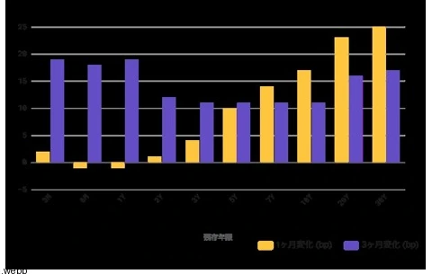

<!--
id: RX-USECASE-0053
type: use-case
language: ja
locale: ja
author: 株式会社QUICK
provider: 株式会社QUICK
provided: 2026-08-19
status: published
translation_status: local-only
source_type: partner-provided-use-case
asset_class: 債券、マクロ
roles: ロングオンリー・アセットマネージャー、ヘッジファンド Tier 1
publication_mode: faithful-source-preserving
-->

# 米30年金利上昇をイールドカーブ全体で読み解く

**著者:** 株式会社QUICK  
**提供日:** 2026-08-19  
**主な運用資産:** 債券、マクロ  
**想定利用者:** ロングオンリー・アセットマネージャー、ヘッジファンド Tier 1
> 本ページは株式会社QUICKから提供されたユースケースを、顧客名・宛先・メールアドレス・署名・非公開URL等を除き、質問から分析・結論へ進む元のストーリーを可能な限り保持して掲載しています。数値・市場環境は提供日時点のものです。

## QUICK提供コンテンツ

Reflexivityの利用例についてご案内します。
今回はAlfredのプロンプト例です。
**米国債30年債の金利が上昇していますが、イールドカーブ全体ではどのような変化がありますか？**

## 要約

米国債の金利上昇は「長期ゾーン主導」で進んでおり、イールドカーブ全体としては**ベア・スティープニング（弱気の傾斜化）**が起きています。30年債が5.31%と数十年ぶりの高水準に達する一方、短期ゾーンはほぼ横ばいで、カーブの「右肩上がり」がより急になりました。

## 主なポイント

- 直近1ヶ月で長期ゾーンが短期ゾーンを大きく上回って上昇（30年 +25bp、10年 +17bp に対し、2年 +1bp、3ヶ月 +2bp）しており、典型的なベア・スティープニングです。
- 30年-10年スプレッドは +0.59%ポイントへ拡大（3ヶ月で約 +6bp）し、超長期の傾斜がさらに立ちました。
- ただしカーブは全体として順イールドを維持しています：10年-2年 +0.52%ポイント、10年-3ヶ月 +0.85%ポイント。逆イールドは既に解消済みです。
- 背景として、報道では財政赤字・債務残高への懸念やタームプレミアムの上昇が、長期金利を数十年ぶりの高水準へ押し上げていると指摘されています。

## チャート・テーブル

米国債イールドカーブ：現在 vs 3ヶ月前  
残存年限別の利回り変化（1ヶ月・3ヶ月）

| 残存年限 | 現在利回り | 1ヶ月変化 | 3ヶ月変化 |
| --- | ---: | ---: | ---: |
| 30Y | 5.31% | +25 bp | +17 bp |
| 20Y | 5.30% | +23 bp | +16 bp |
| 10Y | 4.72% | +17 bp | +11 bp |
| 7Y | 4.54% | +14 bp | +11 bp |
| 5Y | 4.38% | +10 bp | +11 bp |
| 3Y | 4.25% | +4 bp | +11 bp |
| 2Y | 4.19% | +1 bp | +12 bp |
| 1Y | 4.00% | -1 bp | +19 bp |
| 6M | 3.95% | -1 bp | +18 bp |
| 3M | 3.87% | +2 bp | +19 bp |

## 数値サマリー（基準日 2026-08-17）

- 短期：3M 3.87%、6M 3.95%、1Y 4.00%、2Y 4.19%
- 中期：3Y 4.25%、5Y 4.38%、7Y 4.54%
- 長期：10Y 4.72%、20Y 5.30%、30Y 5.31%
**カーブ形状の変化の性質**：金利が全体に上昇（ベア）する中で、長い年限ほど上昇幅が大きい（スティープ化）＝ベア・スティープナー。金融政策の直接的支配下にある短期は据え置き期待で安定、長期は需給・財政・インフレ・タームプレミアム要因で売られやすい構図です。

## 留意点

- 用語定義：ここでの「利回り」は米国債の**定数満期利回り（constant maturity, 投資基準・年率、税引前）**です。スプレッドは同一基準の利回り差（%ポイント）で統一しています。
- データはFREDの日次終値（基準日は上記）で、非営業日は直前営業日の値で補完。3ヶ月前は約91日前の直近営業日を基準としています。
- 変化幅は日次終値に基づくため、当日のイントラデイの動きは反映していません。

## フォローアップ:過去の利上げ・利下げ局面との比較

**過去の利上げ・利下げ局面との比較をしてください**

### 要約

過去の局面と比べると、**利上げ局面ではカーブがフラット化（時に逆イールド化）、利下げ局面ではブル・スティープ化**するのが定石でした。ところが現在はFRBが据え置き（実効FF金利 約3.63%）のなか長期金利が上昇しており、据え置き下で30年金利が +47bp 上昇する一方、2s10sは約18bp縮小＝ベア・フラット化という、政策金利が動かないまま長期主導で金利が上がる特殊な局面に位置しています。

### 主なポイント

- 過去の利上げ局面では2s10sが一貫して縮小＝フラット化（2004–06年 −212bp、2015–18年 −103bp、2022–23年 −132bp）。政策金利上昇に短中期が追随し、長期が相対的に上がりにくいためです。
- 過去の利下げ局面では2s10sが拡大＝ブル・スティープ化する傾向（2007–08年 +110bp、2019年 +30bp、2024–25年 +71bp）。短期が政策金利に沿って急低下するためです。
- 現在は据え置き下で長期金利が上昇（30年 +47bp）しつつ2s10sが約18bp縮小しており、金利の方向は『ベア』だがカーブは『フラット化』。金利上昇が長期主導という点では過去の利上げ局面のフラット化とは背景（財政・需給・タームプレミアム）が異なります。

| 局面 | 政策方向 | FF金利 開始→終了 | 2s10s変化 | 30年金利変化 | カーブの型 |
| --- | --- | --- | ---: | ---: | --- |
| 現在 (2026 据え置き) | 据え置き | 3.64% → 3.63% | -18 bp | +47 bp | ベア・フラット化 |
| 2024–25 利下げ局面 | 利下げ | 5.13% → 3.72% | +71 bp | +64 bp | ベア・スティープ化 |
| 2022–23 利上げ局面 | 利上げ | 0.20% → 5.12% | -132 bp | +191 bp | ベア・フラット化 |
| 2019 利下げ局面 | 利下げ | 2.13% → 0.65% | +30 bp | -109 bp | ブル・スティープ化 |
| 2015–18 利上げ局面 | 利上げ | 0.24% → 2.27% | -103 bp | +11 bp | ベア・フラット化 |
| 2007–08 利下げ局面 (GFC) | 利下げ | 4.94% → 0.16% | +110 bp | -214 bp | ブル・スティープ化 |
| 2004–06 利上げ局面 | 利上げ | 1.03% → 4.99% | -212 bp | -29 bp | ブル・フラット化 |

### 局面別の含意

- **利上げ局面**：フロントエンドが政策金利に牽引されて上昇 → カーブ・フラット化 → 深い引き締めでは逆イールド化する傾向。
- **利下げ局面**：フロントエンドが急低下 → ブル・スティープ化（景気後退局面で顕著）。
- **現在（据え置き）**：政策金利が動かずフロントは安定する一方、長期が売られて上昇 → 金利上昇（ベア）だが2s10sは縮小（フラット化）。過去の利上げ局面のフラット化が「短中期主導」だったのに対し、今回は「長期主導」で生じている点が特徴です。

### 留意点

- 用語定義：「利回り」は米国債の定数満期利回り（constant maturity、投資基準・年率、税引前）、「2s10s」は10年−2年スプレッド（%ポイント）、変化は各局面の開始→終了時点の値差（bp）です。「ブル/ベア」は金利低下/上昇、「スティープ/フラット」は2s10s拡大/縮小を指します。
- 局面区分はFF金利（FRED月次）に基づく代表的な期間設定で、開始・終了日は目安です。
- 局面の期間の取り方により変化幅は変動します。

## 情報源

元資料ではFREDのFEDFUNDS、DGS10、T10Y2Y、T10Y3M、DGS30、DGS2、DGS3、DGS3MO、DGS6MO、DGS7、DGS1、DGS20、DGS5などの金利系列と、関連ニュース・カタリストを参照しています。

## このユースケースの位置づけ

ここに掲載した数値や市場判断は提供日時点のスナップショットです。単発の30年金利の上昇を見るだけでなく、カーブ全体、過去の政策局面、財政・タームプレミアムまで質問を展開していく使い方がポイントです。
[← ユースケース一覧](../../README.md)
