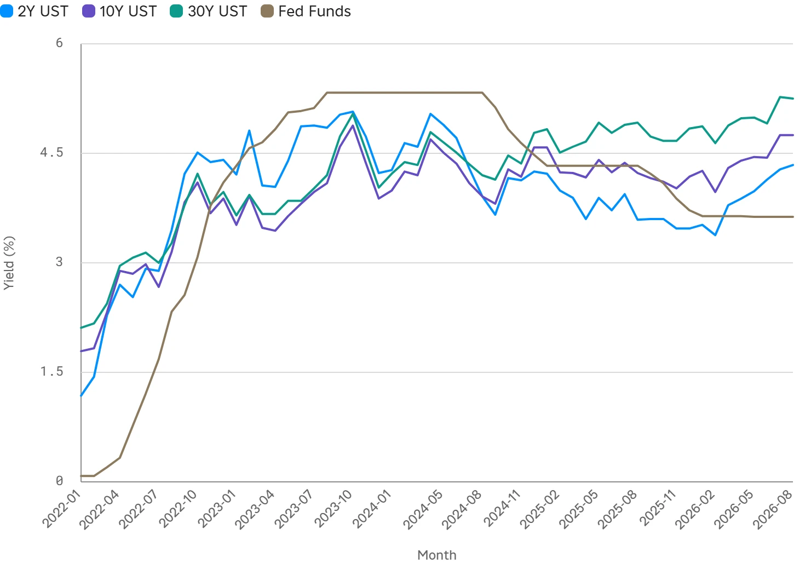
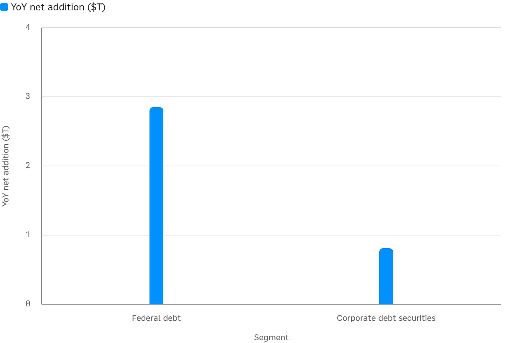

<!--
id: RX-USECASE-0067
type: use-case
language: ja
locale: ja
provider: 株式会社QUICK
provided: 2026-09-25
status: published
translation_status: local-only
revised: 2026-09-27
editorial_reviewed: 2026-09-27
source_type: partner-provided-use-case
asset_class: 債券、マクロ
publication_mode: faithful-source-preserving
-->

# 米国債券発行市場を発行体・資金用途・需給・利回りから分析する

**提供日:** 2026-09-25  
**主な運用資産:** 債券、マクロ

> 本ページは株式会社QUICKから提供されたユースケースを、顧客名・宛先・メールアドレス・署名等を除き、質問から分析・結論へ進む流れを可能な限り保持して掲載しています。数値・市場環境は提供日時点のものです。

> ### [Reflexivityでこの調査例を開く →](https://app.reflexivity.com/alfred?mode=research&conversationId=71c1788f-7e54-4620-a6b2-ab163bd6762f&scrollTo=top)

## 元の質問

**アメリカの債券発行市場で発行額が増えてきています。主な発行体と資金用途を分析してください。また、需給の状況や利回りの変化についても分析してください。**

## まず「誰が、何のために発行しているか」を見る

元の分析では、米国の債券発行が国債・社債ともに拡大していると整理しています。

発行体では、財政赤字をファイナンスする**米国財務省**と、AI・データセンター投資を進める**大型投資適格（IG）企業**が中心です。企業側ではAlphabetやOracleなどの大型テック企業のジャンボ案件が例として挙げられています。

資金用途は次のように分けています。

- 財務省：財政赤字の補填
- 企業：AI・データセンターなどの設備投資
- 金利上昇前の借換え
- M&A・LBO資金
- 自社株買いなどの株主還元

## 金利は長期ゾーンを中心に上昇

| 指標 | 直近（2026-09-23） | 1年前 | 変化 |
| --- | ---: | ---: | ---: |
| 2年債利回り | 4.85% | 3.53% | +1.32pp |
| 10年債利回り | 5.11% | 4.12% | +0.99pp |
| 30年債利回り | 5.40% | 4.73% | +0.67pp |
| FF実効金利 | 3.63% | 4.33% | -0.70pp |
| IG社債OAS | 0.77% | 0.75% | +0.02pp |
| HY社債OAS | 2.73% | 2.71% | +0.02pp |
| IG実効利回り | 5.83% | 4.76% | +1.07pp |
| HY実効利回り | 7.68% | 6.40% | +1.28pp |

短期のFF金利が低下する一方で長期国債利回りは上昇しており、元の分析ではこれを**ベア・スティープ化**として捉えています。

## 大量供給でもクレジットスプレッドはタイト

記録的な供給にもかかわらず、IG・HYのスプレッドは提供日時点で歴史的にタイトな水準にありました。

この点から、元の分析では「供給が増えているから需要が弱い」と単純に判断せず、**高い絶対利回りが投資家需要を引きつけ、大量供給を吸収している**構図と解釈しています。

## 供給規模は債務残高の増加で近似する

連邦政府債務は約39兆ドル規模、非金融企業の債券残高は約16兆ドル規模へ増加したとされています。

ただし元の分析では、発行「額」の直接時系列を取得できなかったため、供給規模を**債務残高（ストック）の前年比純増**で近似しています。これは実際のグロス発行額（フロー）とは異なるため、結果の解釈ではこの違いを明示しています。

## 需給と利回りを一緒に読む

このユースケースのポイントは、発行額の増加だけを見るのではなく、

**発行体 → 資金用途 → 国債・社債の供給増 → 長期金利 → クレジットスプレッド → 投資家需要**

という順番で市場を確認することです。

元の分析では、FRBが利下げでFF金利を下げているにもかかわらず長期金利が上昇している背景として、財務省・企業による大量起債とタームプレミアム上昇を挙げています。その一方でスプレッドがタイトなままであることから、**供給増と強い需要が同時に存在する**としています。

## 分析上の留意点

- 供給規模は債務残高の前年比純増による近似で、グロス発行額とは異なります。
- IG発行額など一部の数値は市場コメンタリーに基づく二次情報です。
- 残高データは四半期、利回り・スプレッドは日次で、参照時点が異なります。
- 具体的な数値を使う場合は、元資料に記載されたFRED、SIFMAなどの参照元と時点を併せて確認する必要があります。

元資料では、AI関連企業の起債動向や財務省オークションの応札倍率まで掘り下げる次の調査も提案しています。

---

本コンテンツは、株式会社QUICKよりご提供いただいたものです。

国・地域や言語環境、利用製品、データ提供範囲などによっては、内容をそのまま適用できない場合があります。

[← 債券ユースケース](README.md) · [ユースケース一覧](../../README.md)
