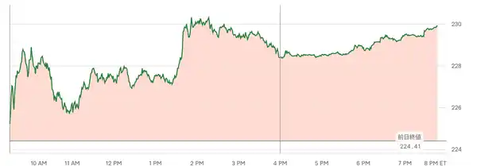

<!--
id: RX-USECASE-0057
type: use-case
language: ja
locale: ja
author: 株式会社QUICK
provider: 株式会社QUICK
provided: 2026-09-04
status: published
translation_status: local-only
source_type: partner-provided-use-case
asset_class: 株式
roles: ウェルスマネジメント / RIA、ロングオンリー・アセットマネージャー、ヘッジファンド Tier 1、ヘッジファンド Tier 2、ヘッジファンド Tier 3
publication_mode: faithful-source-preserving
-->

# 企業カタリストでNVIDIA関連ニュースの株価影響を確認する

**著者:** 株式会社QUICK  
**提供日:** 2026-09-04  
**主な運用資産:** 株式  
**想定利用者:** ウェルスマネジメント / RIA、ロングオンリー・アセットマネージャー、ヘッジファンド Tier 1、ヘッジファンド Tier 2、ヘッジファンド Tier 3
> 本ページは株式会社QUICKから提供されたユースケースを、顧客名・宛先・メールアドレス・署名・非公開URL等を除き、元資料のストーリーを可能な限り保持して掲載しています。数値・市場環境は提供日時点のものです。

タイトルをクリックすると、Company Catalystでニュースの要点から市場への波及まで順番に確認できます。

### NVIDIA、129億ドルでHugging Faceを買収

## この機能を使う場面

企業ニュースを見た直後に知りたいのは、ニュースの要約だけではありません。まず「何が起きたのか」と株価の初期反応を確認し、次に経営陣の説明や取引の意味を読み、その後で競争環境、関連企業、規制、地域エクスポージャーへ広げていく必要があります。

この例では、**ニュースの要点 → 市場反応 → 経営陣の説明 → ネットワーク上の波及 → 地域別の論点**という順番で、直接的な影響から二次的な影響へ調査範囲を広げます。

## トップ5の要点

買収の概要に加えて、開発者エコシステムへの影響、競争・規制上の論点、市場への波及を確認します。最初に要点を整理することで、その後の詳細分析で何を検証すべきかを絞れます。

次に、ニュース発表後の市場反応を確認します。材料の重要性を考えるうえでは、内容だけでなく、市場がどの程度すぐに価格へ織り込んだかを見ることが重要です。

## リーダーシップの引用

市場反応を確認したら、次に経営陣自身が取引をどう位置づけているかを読みます。株価の反応だけでは、プラットフォームの中立性や統合方針といった中長期の論点までは判断できないためです。

> 「Hugging Faceは、AIエコシステム全体にとってオープンなプラットフォームであり続けます。開発者は、希望するモデル、フレームワーク、クラウドおよび推論サービスプロバイダー、コンピューティングプラットフォームを選択します。Hugging Face上での構築または展開にNVIDIAのコンピューティングは必要ありません。」
>
> Jensen Huang, 最高経営責任者, NVIDIA
>
> 「共に、Hugging Faceのプラットフォームを拡大し、インフラストラクチャを強化し、世界中の開発者や機関向けのAIへのアクセスを拡大します。」
>
> Jensen Huang, 最高経営責任者, NVIDIA

## Reflexivity Graph

ここから調査を一段広げます。直接のニュースとNVIDIA株の反応だけでは、取引が競争相手、開発者エコシステム、モデル配布、規制上の論点へどう波及するかは見えません。Reflexivity Graphでは、企業同士の関係やカタリストの波及経路をたどり、二次的な受益・リスク候補を探します。

この買収により、NVIDIAは単なるコンピューティングだけでなく、開発者およびモデル配布レイヤーへとさらに進出します。業界の主要な疑問は、Hugging Faceが開発者のトラフィックを維持するために十分に中立的であり続ける一方で、NVIDIAがオープンモデルの評価、展開、スケーリング方法に対する影響力を高めることができるかどうかです。

Hugging Faceはオープンモデル配布に位置しているため、取引完了までの経路が重要です。合併審査とモデルガバナンスのルールはプラットフォームの価値を変える可能性があります。NVIDIAはまた、中国起源のオープンソースモデルに対する制限を、期待される取引利益へのリスクとして指摘しました。

財務的には、この取引はNVIDIAが有機的な製品リーダーシップだけでなく、エコシステムの支配力を高めるためにも大規模な投資を行う意思を示すものです。議論は、129億ドルの価格と追加の維持パッケージが一度限りの資産獲得となるのか、それとも広範なAIプラットフォームM&Aの始まりとなるのかに移ります。

## 地域エクスポージャー

最後に地域別の論点を確認します。プラットフォーム型の取引では、企業単体の業績だけでなく、規制環境やモデル利用条件、開発者基盤が地域によって異なるためです。

NVIDIAは単なるソフトウェア資産ではなく、グローバルなオープンAIプラットフォームを購入するため、地理的な露出が重要です。上振れ余地は、米国での運用基盤全体にHugging Faceを統合し、欧州のプラットフォーム周辺の継続性を維持し、モデルの利用可能性や開発者の利用を狭める地域的な制限を回避できるかどうかにかかっています。

## 運用上の読み方

Company Catalystは、見出しの内容を短く知るためだけのものではありません。まず直接の株価反応を確認し、その反応を説明する材料を読み、さらに関連企業・競争環境・規制・地域へ広げることで、「次にどこを調べるべきか」を具体化するために使えます。

## このユースケースの位置づけ

Company Catalystを単なるニュース要約として見るのではなく、重要ポイント、経営陣発言、ネットワーク波及、地域エクスポージャーへ順番に掘り下げる例です。

[← ユースケース一覧](../../README.md)
