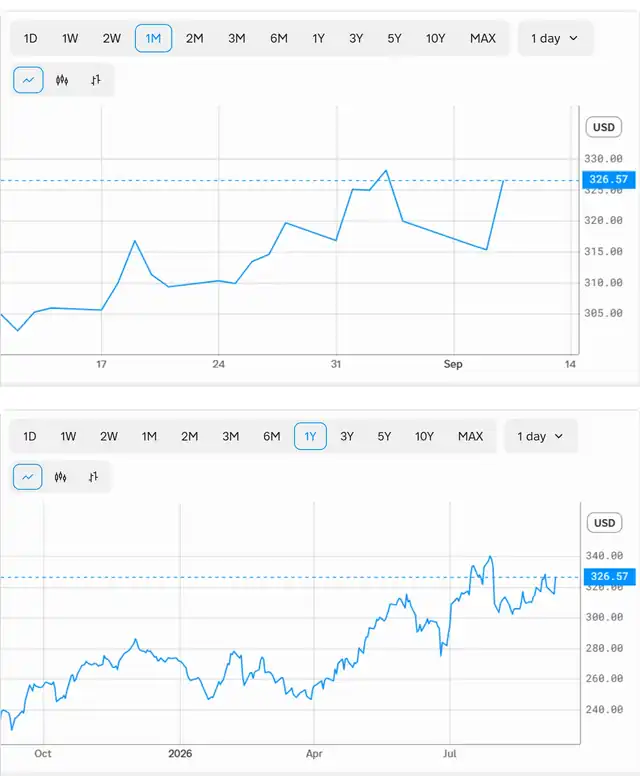

<!--
id: RX-USECASE-0046
type: use-case
language: ja
locale: ja
author: 株式会社QUICK
provider: 株式会社QUICK
provided: 2026-09-11
status: published
translation_status: local-only
source_type: partner-provided-use-case
asset_class: 株式
roles: ウェルスマネジメント / RIA、ロングオンリー・アセットマネージャー、ヘッジファンド Tier 2、ヘッジファンド Tier 3
publication_mode: faithful-source-preserving
-->
# 新型iPhone発表前後のAAPL株価を過去5年で検証する
**著者:** 株式会社QUICK  
**提供日:** 2026-09-11  
**主な運用資産:** 株式  
**想定利用者:** ウェルスマネジメント / RIA、ロングオンリー・アセットマネージャー、ヘッジファンド Tier 2、ヘッジファンド Tier 3
> 本ページは株式会社QUICKから提供されたユースケースを、顧客名・宛先・メールアドレス・署名・非公開URL等を除き、質問から分析・結論へ進む元のストーリーを可能な限り保持して掲載しています。数値・市場環境は提供日時点のものです。
## QUICK提供コンテンツ
一昨日、新型iPhoneの発表がありました。
（私もiPhoneユーザーですが、今回のDuo38万円は手が出ません。。。）
iPhoneの新モデル発表タイミングと株価についてAlfredで分析してみました。
**AAPL:NASD の新型iPhone発表のタイミングと株価の関係について、過去5年間の傾向を分析してください。また、今回のDuoの発表についての市場の反応も分析してください。**

## AAPLの新型iPhone発表と株価:過去5年の傾向と今回のDuo発表分析
## 結論(先に要点）
- **過去5年、iPhone発表は典型的な「噂で買って事実で売る(sell the news)」パターン**を示してきました。発表イベント当日は株価が小動き〜小幅安になりやすく、その後数週間〜四半期で回復・上昇する傾向が繰り返されています。
- **今回のiPhone Duo(初の折りたたみ、9月9日発表)は例外的にポジティブな反応**。発表当日(9/9)の終値は約-0.3%とほぼ横ばいでしたが、翌9/10には**約+2.4%上昇**し、直近値は約326.57ドル。市場は「価格戦略」を好感しています。
## 過去5年の発表タイミングと株価の傾向
| 年 | 発表イベント | イベント直前 | 直後 | 数週間後の傾向 |
| --- | --- | --- | --- | --- |
| 2021 (iPhone 13) | 9/14 | 9/9: 154.07 | 9/14: 148.12 → 9/16: 148.79 | 発表後に一旦軟化、年末にかけ179ドル台へ大幅上昇 |
| 2022 (iPhone 14) | 9/7 | 9/1: 157.96 | 9/7: 155.96 → 9/9: 157.37 | マクロ悪化で以降下落(その年特有) |
| 2023 (iPhone 15) | 9/12 | 9/5: 189.70 | 9/12: 176.30 → 9/14: 175.74 | 発表前後で軟調(「売り」反応が顕著) |
| 2024 (iPhone 16) | 9/9 | 9/5: 222.38 | 9/9: 220.91 → 9/12: 222.77 | 横ばい後、月末に233ドルへ回復 |
| 2025 (iPhone 17) | 9/9 | 9/9: 234.35 | 9/11: 230.03 | いったん下げ後に急反発、9/23に254ドル超 |
| 2026 (iPhone Duo/18) | 9/9 | 9/4: 319.97 | 9/9: ▲0.3% → 9/10: +2.4% (326.57) | 発表を機に上昇基調 |
**読み取れる傾向:**
1. **当日は「材料出尽くし」で反応が鈍い、または小幅安**になりやすい(2021・2023・2025が典型)。
2. **中期(数週〜1四半期)ではプラスに転じることが多い**。発表前の期待先行より、その後の実売・出荷データの方が株価を動かす。
3. 例外はマクロ要因(2022年の利上げ・弱気相場)で、iPhone発表そのものより地合いに左右された年もあります。
## 今回の「iPhone Duo」発表への市場反応
**製品概要:** Appleは初の折りたたみiPhone「iPhone Duo」を9月9日に発表(7.6インチ内側ディスプレイ、A20 Proチップ、開始価格**1,999ドル**、予約10/16・発売10/23)。同時にiPhone 18 Pro/Pro Max(1,199/1,299ドル、前年比+100ドル)、Apple Watch Series 12/Ultra 4、AirPods 5も発表。新CEO John Ternus氏の初の大型発表イベントでした。
**株価反応:** 発表当日(水)は-0.3%とほぼ無風でしたが、翌日(木)に**+2.4%上昇**。年初来では約+19%。
**なぜ好反応だったか(市場・アナリストの見方):**
- **価格が想定より安かった**ことが最大の好感材料。Duoの1,999ドルは投資家予想の2,300〜2,500ドルを下回り、Samsung Galaxy Z Fold7とほぼ同水準。Morgan Stanleyは「Appleは短期の利益最大化より**普及(数量)を優先**している」と評価。
- Pro/Pro Maxの値上げも+100ドルにとどまり、UBSは「需要とコスト増のバランスが取れた妥当な水準」と評価。
- **強気の需要見通し:** Morgan Stanleyは12月四半期にDuoが約140億ドル(iPhone売上の16%)寄与と試算。Dan Ives氏は「4年間アップグレードしていない3億台の買い替え需要」を指摘し、Duoがいずれ iPhone収益の20%を担う可能性に言及。
**留意点(慎重な見方):**
- **粗利益率への圧力:** メモリ・部品コスト高の中で価格を抑えたため、BofAは「販売増につながる一方でマージンを圧迫」とし、目標株価を380→370ドルへ小幅引き下げ。
- **供給制約:** Tigressは折りたたみの本格出荷が第4四半期後半にずれ込み、初期の業績寄与は限定的と指摘。
## まとめ
過去5年の傾向どおり「発表当日は反応が鈍い」パターンは今回も踏襲されましたが、**予想を下回る価格設定が翌日の+2.4%という明確な買い反応**を引き出した点が特徴的です。歴史的にAAPL株は発表後の実売・出荷データで方向感が決まるため、今後の注目点はDuoの初期販売と12月四半期の出荷実績、そしてマージンへの影響になります。
## 情報源
- エンティティ: AAPL:NASD
- 時系列データ: AAPL:NASD.price
- 元資料では製品発表、アナリスト見解、価格設定、市場反応に関する複数のニュースを参照しています。
## このユースケースの位置づけ
ここに掲載した数値や市場判断は提供日時点のスナップショットです。ユースケースとしては、同じ質問の型を最新データや別の企業イベントに置き換え、Researchを再実行することを想定しています。
[← ユースケース一覧](../../README.md)
