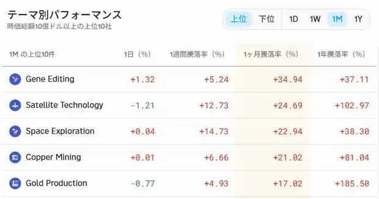

<!--
id: RX-USECASE-0047
type: use-case
language: ja
locale: ja
author: 株式会社QUICK
provider: 株式会社QUICK
provided: 2025-12-26
status: published
translation_status: local-only
source_type: partner-provided-use-case
asset_class: 株式
roles: ロングオンリー・アセットマネージャー, ヘッジファンド Tier 2, ヘッジファンド Tier 3
publication_mode: faithful-source-preserving
-->

# 注目テーマから米国・日本の関連企業をピックアップする

**著者:** 株式会社QUICK  
**提供日:** 2025-12-26  
**主な運用資産:** 株式  
**想定利用者:** ロングオンリー・アセットマネージャー, ヘッジファンド Tier 2, ヘッジファンド Tier 3
> 本ページは株式会社QUICKから提供されたユースケースを、顧客名・宛先・メールアドレス・署名・非公開URL等を除き、質問から分析・結論へ進む元のストーリーを可能な限り保持して掲載しています。数値・市場環境は提供日時点のものです。

## 原資料の画面

原資料に含まれていたReflexivityの画面・チャートを、掲載順を保ってまとめています。

## この機能を使う場面

テーマランキングで値上がりしている分野を見つけても、そのままでは投資対象の企業までは分かりません。この例では、**市場で強いテーマを入口にして、米国と日本の関連企業候補へ広げる**ことで、次に調べるユニバースを作っています。

元資料では、ダッシュボード右下の米国株テーマ別騰落から1カ月パフォーマンス上位5テーマを取り出し、そのテーマごとにAlfredで米国・日本の企業を3社ずつ挙げています。

ここでの目的は最終的な銘柄選定ではなく、**テーマ → 関連企業候補 → 次の財務・バリュエーション・上場条件の確認**というスクリーニングの最初の段階です。元の指示では上場企業に限定していないためJAXAも含まれ、また財務状況などはこの段階では加味していません。

### Alfredの質問

> 遺伝子編集、衛星技術、宇宙探索、銅鉱山、金の生産というテーマに関連する企業について、米国と日本でそれぞれ各ジャンルごとに3社ずつリストアップしてください。

## 回答

### 遺伝子編集

**米国**
- CRISPR Therapeutics - CRISPR-Cas9技術を用いた遺伝子編集治療法の開発で知られるリーディングカンパニー
- Intellia Therapeutics - CRISPR-Cas9を基盤としたゲノム編集医薬品の開発に注力
- Editas Medicine - CRISPR技術を活用し、遺伝性疾患の治療法開発を目指す

**日本**
- タカラバイオ - 遺伝子導入技術や遺伝子解析技術に強みを持ち、遺伝子治療や再生医療分野で研究開発を推進
- サンバイオ - iPS細胞を用いた再生医療等製品の開発を実施
- ジーンテクノサイエンス - 遺伝子治療薬の開発・製造受託(CDMO)を実施

### 衛星技術

**米国**
- Maxar Technologies - 高解像度の地球観測衛星画像を提供し、地理空間情報サービスを展開
- Planet Labs - 小型衛星コンステレーションを運用し、地球全体の画像を毎日取得・提供
- SpaceX - 衛星インターネットサービス「Starlink」を展開

**日本**
- 三菱電機 - 衛星バスや搭載機器の開発・製造で実績
- NEC - 衛星通信システムや地上システム、衛星搭載機器などの開発・製造を実施
- キヤノン電子 - 小型人工衛星の開発・製造を手掛ける

### 宇宙探索

**米国**
- SpaceX - 再利用可能なロケット技術を開発し、宇宙輸送サービスや有人宇宙飛行を実現
- Blue Origin - 宇宙旅行や宇宙インフラの構築を目指し、ロケットや宇宙船を開発
- Lockheed Martin - NASAの宇宙探査ミッション向けの宇宙船や探査機を開発・製造

**日本**
- 三菱重工業 - 国産ロケット「H-IIA」「H-IIB」などを開発・運用し、衛星打ち上げサービスを提供
- JAXA（宇宙航空研究開発機構） - 小惑星探査機「はやぶさ」シリーズなど、数々の宇宙探査ミッションを主導
- IHI - ロケットエンジンの開発・製造に携わり、日本の宇宙開発を支援

### 銅鉱山

**米国**
- Freeport-McMoRan - 世界有数の銅生産企業であり、北米を中心に大規模な銅鉱山を操業
- Southern Copper Corporation - 米国およびメキシコで銅、モリブデン、亜鉛などを生産
- Kennecott (Rio Tintoグループ) - ユタ州にある世界最大級の露天掘り銅鉱山を操業

**日本**
- 住友金属鉱山 - 海外での銅鉱山開発・操業に積極的に取り組む日本を代表する非鉄金属企業
- 三井金属鉱業 - 金属製錬事業の一部として銅関連事業を実施
- JX金属 - 非鉄金属製錬事業を展開し、銅の精錬も実施

### 金の生産

**米国**
- Barrick Gold - 世界最大級の金生産企業の一つで、北米にも主要な鉱山を保有
- Newmont Corporation - 世界最大の金生産企業であり、米国国内にも複数の金鉱山を操業
- Kinross Gold - 北米を含む世界各地で金鉱山を開発・操業

**日本**
- 住友金属鉱山 - 金の生産・販売を行い、海外での金鉱山開発・操業も実施
- 田中貴金属工業 - 金地金などの貴金属製品の製造・販売を行い、リサイクル事業も展開
- 三菱マテリアル - 非鉄金属事業の一部として、金の精錬や販売を実施

**注:** 日本国内には大規模な銅鉱山や金鉱山はほとんどなく、多くの企業は海外での資源開発や金属精錬・リサイクル事業に従事しています。

## 次に何を確認するか

この一覧は「関連している企業」を広く見つける段階です。元資料でも、上場企業に限定していないこと、財務状況をまだ加味していないことが明示されています。

実際の投資ユニバースへ進める場合は、次のような条件を追加して候補を絞れます。

- 上場企業のみ
- テーマからの売上・利益エクスポージャー
- 時価総額・流動性
- 財務健全性・業績見通し
- バリュエーション
- 米国・日本など対象市場

この順番にすることで、人気テーマから直接「買う銘柄」を決めるのではなく、まず探索範囲を広げてから投資条件で絞り込めます。

## このユースケースの位置づけ

米国で注目されている値上がりテーマを起点に、米国・日本の関連企業候補へ広げる使い方です。AIやデータセンター以外の思いがけないテーマを見つけ、その後の企業分析へつなげる入口として利用できます。

---

[← 運用資産別ユースケース](../README.md) · [ユースケース一覧](../../README.md)
