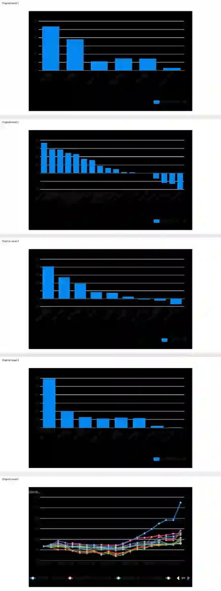

<!--
id: RX-USECASE-0038
type: use-case
language: ja
locale: ja
author: QUICK
provider: 株式会社QUICK
source_created: 2026-05-15
provided: 2026-05-15
kb_imported: 2026-09-15
status: published
translation_status: local-only
source_type: partner-provided-use-case
asset_class: 株式、マルチアセット
-->

# 米国株と日本株の市場けん引テーマを比較する

**著者:** QUICK  
**提供日:** 2026-05-15  
**主な運用資産・領域:** 株式、マルチアセット

> 本ページはQUICKから提供された活用例について、顧客名・受信者情報・署名等を除き、質問、分析の流れ、結果、図表をできる限り元資料に沿って再掲載しています。数値・市場環境は提供日時点のものです。

## QUICK提供内容

アメリカ株式市場で市場をけん引している企業の属するテーマと、日本の株式市場で市場をけん引している企業の属するテーマには類似性がありますか？違いがあるとすればどのような部分でしょうか？この3か月間のパフォーマンスをもとに分析してください。

# 米国・日本株式市場を牽引するテーマの比較分析（2026年2月〜5月）

> 分析期間：2026年2月14日〜2026年5月14日 (約3ヶ月間)  
> ベンチマーク：S&P 500 +8.2%、日経225 +11.4%、USD/JPY +2.8%（円安）

## チャート・データ概観

日米トップ銘柄 正規化パフォーマンス比較

### 元資料の図表・画面

元資料で本文中に掲載されていた図表・画面を、登場順にまとめて掲載しています。

米国セクターETFパフォーマンスランキング

日本主要銘柄パフォーマンスランキング（全銘柄）

AI・半導体テーマ：日米企業パフォーマンス比較

産業自動化テーマ：日米企業パフォーマンス比較

### テーマ別 日米比較サマリー

| テーマ | 米国代表企業 | 米国リターン | 日本代表企業 | 日本リターン | 類似度 |
| --- | --- | ---: | --- | ---: | --- |
| AIチップ・加速コンピューティング | AMD, NVIDIA, Broadcom | +55.6% | SoftBank, Renesas | +25.5% | ◎ 高 |
| 半導体製造装置 | SMH ETF（AMAT,LRCX,KLA含む） | +40.5% | Tokyo Electron, Disco, Advantest | +9.8% | ◎ 高 |
| クラウド・AIプラットフォーム | Amazon, Alphabet, Microsoft | +23.2% | （日本に直接対応なし） | N/A | △ 低 |
| 産業自動化・ロボティクス | Rockwell Automation, Cognex | +14.3% | Keyence, Yaskawa, Fanuc, 三菱電機 | +25.0% | ○ 類似・日本優位 |
| AI投資・ベンチャー | （Big TechのAI R&D支出として内包） | - | SoftBank Group | +28.2% | △ 低 |
| 自動車・モビリティ | XLY ETF（自動車含む消費財） | +2.3% | Toyota | -19.8% | ✕ 対照的 |
| 金融・銀行 | XLF ETF（金融） | -2.3% | MUFG, SMFG | +0.2% | ○ 類似 |
| ヘルスケア | XLV ETF（ヘルスケア） | -6.8% | （主要指数牽引企業なし） | N/A | - 非対称 |

## 主要パフォーマンスデータ

### 米国（主要銘柄リターン）

| 銘柄 | 3ヶ月リターン | 主なテーマ |
| --- | ---: | --- |
| AMD | +119.4% | AIチップ、加速コンピューティング、データセンター |
| Amazon | +34.3% | クラウドコンピューティング、AI、Eコマース |
| Alphabet | +33.3% | クラウドコンピューティング、検索、AI |
| Broadcom | +25.3% | AIチップ、半導体、データネットワーク |
| NVIDIA | +22.1% | AI GPU、加速コンピューティング、データセンター |
| SMH（半導体ETF） | +40.5% | 半導体製造装置・AIチップ全般 |
| XLK（テクETF） | +26.8% | テクノロジーセクター全般 |

### 日本（主要銘柄リターン）

| 銘柄 | 3ヶ月リターン | 主なテーマ |
| --- | ---: | --- |
| Keyence | +36.6% | 産業自動化、産業センサー、産業技術 |
| Yaskawa Electric | +28.8% | 産業自動化、ロボティクス |
| SoftBank Group | +28.2% | AI（生成AI/LLM）、AIチップ、ロボティクス |
| Tokyo Electron | +24.1% | 半導体製造装置、AIインフラ |
| Renesas Electronics | +22.8% | 半導体チップ、車載半導体、IoT |
| Fanuc | +15.5% | 産業自動化、ロボティクス、産業機械 |
| Toyota | -19.8% | 自動車（関税・中国EV競争の直撃） |

## 分析結果

### ◎ 類似点①：AI・半導体が「共通の市場牽引役」

最も際立つ共通点は、**AIと半導体への需要急増が両市場をともに牽引している**点です。

- **米国**ではAMD（Q1 FY2026決算が市場予想を上回り、AI GPU需要急増を確認、株価+119.4%）、NVIDIA（時価総額5兆ドル突破）、Broadcom（+25.3%）がAIチップ・データセンターテーマで大幅上昇。半導体ETF（SMH）の+40.5%は全セクター中トップ。
- **日本**ではSoftBank Group（NVIDIAおよびFoxconnとのAIサーバー生産交渉）、Renesas Electronics（Q1純利益+162%）が同じAI・半導体テーマで上昇。Tokyo Electron（半導体製造装置、+24.1%）も恩恵を受けた。

**どちらの市場でも「AI需要の連鎖」が最大のリターン源となっており、テーマの方向性は一致しています。**

### ◎ 類似点②：半導体製造装置セクターの連動

半導体製造装置というバリューチェーン上の「上流」テーマでも日米は連動しています。米国の半導体装置株（AMAT、LRCX、KLAを含むSMH）が+40.5%を記録した一方、日本の東京エレクトロン（Tokyo Electron）も+24.1%を達成。知識グラフでも両者は「Semiconductor Equipment」「AI Infrastructure」という共通テーマを持ちます。ただし上昇率は米国が大きく、米国装置株の優位性が際立ちます。

### ✕ 相違点①：産業自動化・ロボティクスは「日本が独走」

**産業自動化テーマは、日本市場固有の強みが突出した分野です。**

- 日本：Keyence（+36.6%、純利益12%増）、Yaskawa Electric（+28.8%、Jefferiesが株価目標を大幅引き上げ）、Fanuc（+15.5%）、三菱電機（+17.2%）と、大型の自動化・ロボティクス銘柄が軒並み市場を大きく上回った。
- 米国：同じ産業自動化テーマの代表格であるRockwell Automation（+17.1%）やCognex（+11.5%）は、S&P 500を上回ったものの、日本勢と比べると見劣りします。米国の産業ETF（XLI）全体は-0.8%とむしろ下落。

知識グラフの「Industrial Automation」テーマに占める日本企業（Fanuc #4、SMC #8、Daifuku #9、Keyence #10、Yaskawa #11）の比重の高さが数字として明確に現れました。**日本は製造業DX（工場の自動化・ロボット化）への需要が、AI需要と連動する形でパフォーマンスを引き上げています。**

### ✕ 相違点②：クラウド・デジタルプラットフォームは「米国独自のテーマ」

**日本市場には、Amazon・Alphabet・Microsoftのような「グローバルAIクラウドプラットフォーマー」が存在しません。**

- Amazon（+34.3%）、Alphabet（+33.3%）はそれぞれ「クラウドコンピューティング + AI」テーマで大幅上昇。これらの企業はAIを活用したクラウドサービス（AWS、Google Cloud）の拡大を直接収益化している。
- 日本の同等企業（Fujitsu、日立）はむしろ下落（Fujitsu -11.9%、日立 -6.6%）。SoftBankがAI投資・LLMテーマで+28.2%を記録したが、これはクラウドサービスの提供者ではなくAI投資持株会社としての性格が強い。

この「ソフトウェア・プラットフォーム層でのAIマネタイズ」は米国市場固有の牽引力であり、日本市場との最大の構造的差異です。

### ✕ 相違点③：自動車・製造業の関税リスクは「日本市場固有の圧力」

Toyotaが-19.8%と市場全体を大きく下回ったことが象徴的です。報道によれば、Toyotaは米国関税とコスト圧力、中国でのEV競争激化を理由にFY2027の利益を22%減益と予想。同様の懸念はホンダの中国販売急落にも見られます。

米国では自動車を含む消費財ETF（XLY）が+2.3%と軽微な影響にとどまり、対照的な結果となりました。日本市場はグローバルな製造業・輸出企業の比率が高いため、関税・為替・海外競争のリスクが直接的にインデックスパフォーマンスに影響します。

## まとめ：テーマの「共鳴」と「断層」

| 観点 | 類似 | 異なる |
| --- | --- | --- |
| AI・半導体需要 | ✅ 両市場の最大牽引役 | 米国はチップ設計、日本は装置・投資経由 |
| 産業自動化 | △ 同テーマ存在 | ✅ 日本が圧倒的優位（テーマの「主役」が逆転） |
| クラウド・SaaS・AI基盤 | ❌ 日本にプレイヤーなし | 米国独自（Amazon/Alphabet/Microsoft） |
| 自動車・製造業リスク | ❌ 影響度に大差 | 日本固有のリスク（関税・EV・円高） |
| 金融 | ✅ 両市場で市場平均に劣後 | 差は軽微 |

**要約すると、AIと半導体という「大テーマの方向性」は日米両市場で共鳴しています。しかし米国はAIを設計・実装・マネタイズする「ソフトウェア・チップ設計型」の企業が牽引するのに対し、日本はAIに不可欠なハードウェア（装置・センサー・自動化機器）を供給する「製造業・ハードウェア型」の企業が牽引しているという明確な構造的差異があります。**

## 既知の限界

- 日本株のパフォーマンスはJPY建てで計算しており、USD/JPY+2.8%（円安）の為替効果を含んでいます。ドル建てに換算すると日本株の実質リターンはわずかに低下します。
- セクター分類は代表企業の抽出であり、TOPIX業種別指数の公式データには基づいていません。
- AMDの+119.4%は期間中のQ1 FY2026決算発表後の急騰が主因と見られますが、決算数値の詳細は入手できていません。
- 産業自動化テーマの日本銘柄（特にYaskawa）は実際の業績（FY純利益-38%）よりも「AI化・回復期待」による先行評価で上昇している可能性があります。

日本の装置・自動化テーマの企業（例：TEL、Keyenceの収益の質や受注動向）や、米国の「AMD急騰の持続性」についてさらに深掘りすることも可能です。

## 情報源

元資料では39のエンティティ・時系列、Knowledge Graphのtheme exposure、27件の関連ニュースを用いています。個別の内部Research URLは公開ページでは掲載していません。

[← 運用資産別ユースケース](../README.md) · [ユースケース一覧](../../README.md)
